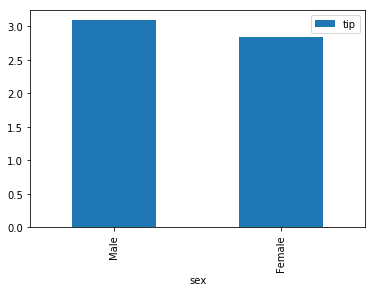
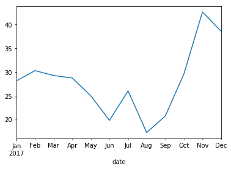
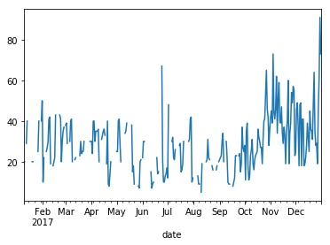

<center><h1>IPA 주관 인공지능센터 기본(fundamental) 과정</h1></center>
<ul style="display: table; margin-left: auto; margin-right: auto;">
    <li>GitHub link: <a href="https://github.com/Wind-Kyle/ai-course-fundamentals">here</a></li>
    <li>E-Mail: windkyle7@gmail.com</li>
</ul>

# Pandas

## Why Pandas ?

`판다스(Pandas)`를 사용하는 목적은 대표적으로 <b>두 가지</b> 이유가 있다.
- EDA(Exploratory data analysis)
  - 통계값 분석
  - Visualization
- Preprocessing

## What is Pandas ?

쉽게 말하면 `판다스 = 엑셀`이다. 다만 빅데이터를 다룰 때 엑셀로 데이터를 분석하려고 하면 엄청나게 느리고 메모리 리소스도 많이 잡아먹기 때문에 판다스를 사용하면 굉장히 빠르고 간편하게 사용할 수 있다.

- 왜 빠른가?? --> 판다스 역시 NumPy 기반으로 만들어졌기 때문에.

## 판다스 처음 사용해보기

먼저 `pandas`를 임포트한다. 그리고 alias는 <b>관례적</b>으로 `pd`를 사용한다.


```python
import pandas as pd
```

현재 실습에서 사용하는 판다스 버전은 다음과 같다.


```python
pd.__version__
```


    '0.24.2'


실습에 사용할 데이터는 공공데이터포털에서 제공하는 교통사고 데이터를 가지고 진행하고자 한다. 

<b>공공데이터포털</b>은 [여기](https://www.data.go.kr/)로 들어가서 교통사고 데이터를 다운로드 받은 후에 `csv` 파일을 불러온다.

데이터를 불러올 시, `UnicodeDecodeError` 예외가 발생한다면 가장 먼저 `engine` 인자값에 `python`을 먼저 넣어주고 그 다음에 인코딩을 시도해본다.


```python
data = pd.read_csv('data/accident01.csv', engine='python', encoding='cp949')
```

그럼 불러온 데이터를 한번 확인해보자.


```python
data[:10]
```


<div>
<style scoped>
    .dataframe tbody tr th:only-of-type {
        vertical-align: middle;
    }

    .dataframe tbody tr th {
        vertical-align: top;
    }

    .dataframe thead th {
        text-align: right;
    }
</style>
<table border="1" class="dataframe">
  <thead>
    <tr style="text-align: right;">
      <th></th>
      <th>시도</th>
      <th>시군구</th>
      <th>월</th>
      <th>발생건수</th>
      <th>사망자수</th>
      <th>부상자수</th>
      <th>중상</th>
      <th>경상</th>
      <th>부상신고</th>
    </tr>
  </thead>
  <tbody>
    <tr>
      <th>0</th>
      <td>서울</td>
      <td>종로구</td>
      <td>01월</td>
      <td>103</td>
      <td>0</td>
      <td>133</td>
      <td>23</td>
      <td>90</td>
      <td>20</td>
    </tr>
    <tr>
      <th>1</th>
      <td>서울</td>
      <td>종로구</td>
      <td>02월</td>
      <td>84</td>
      <td>1</td>
      <td>111</td>
      <td>20</td>
      <td>77</td>
      <td>14</td>
    </tr>
    <tr>
      <th>2</th>
      <td>서울</td>
      <td>종로구</td>
      <td>03월</td>
      <td>101</td>
      <td>0</td>
      <td>149</td>
      <td>34</td>
      <td>91</td>
      <td>24</td>
    </tr>
    <tr>
      <th>3</th>
      <td>서울</td>
      <td>종로구</td>
      <td>04월</td>
      <td>93</td>
      <td>0</td>
      <td>114</td>
      <td>27</td>
      <td>78</td>
      <td>9</td>
    </tr>
    <tr>
      <th>4</th>
      <td>서울</td>
      <td>종로구</td>
      <td>05월</td>
      <td>102</td>
      <td>1</td>
      <td>143</td>
      <td>24</td>
      <td>96</td>
      <td>23</td>
    </tr>
    <tr>
      <th>5</th>
      <td>서울</td>
      <td>종로구</td>
      <td>06월</td>
      <td>96</td>
      <td>1</td>
      <td>123</td>
      <td>32</td>
      <td>84</td>
      <td>7</td>
    </tr>
    <tr>
      <th>6</th>
      <td>서울</td>
      <td>종로구</td>
      <td>07월</td>
      <td>89</td>
      <td>0</td>
      <td>128</td>
      <td>28</td>
      <td>83</td>
      <td>17</td>
    </tr>
    <tr>
      <th>7</th>
      <td>서울</td>
      <td>종로구</td>
      <td>08월</td>
      <td>90</td>
      <td>0</td>
      <td>127</td>
      <td>29</td>
      <td>85</td>
      <td>13</td>
    </tr>
    <tr>
      <th>8</th>
      <td>서울</td>
      <td>종로구</td>
      <td>09월</td>
      <td>91</td>
      <td>1</td>
      <td>133</td>
      <td>24</td>
      <td>96</td>
      <td>13</td>
    </tr>
    <tr>
      <th>9</th>
      <td>서울</td>
      <td>종로구</td>
      <td>10월</td>
      <td>113</td>
      <td>0</td>
      <td>166</td>
      <td>30</td>
      <td>109</td>
      <td>27</td>
    </tr>
  </tbody>
</table>
</div>


불러온 데이터는 `데이터 프레임(DataFrame)` 타입이다.


```python
type(data)
```


    pandas.core.frame.DataFrame


어떤 데이터들이 있는지 한번 확인해본다.


```python
data.values
```


    array([['서울', '종로구', '01월', ..., 23, 90, 20],
           ['서울', '종로구', '02월', ..., 20, 77, 14],
           ['서울', '종로구', '03월', ..., 34, 91, 24],
           ...,
           ['세종', '세종', '10월', ..., 22, 66, 2],
           ['세종', '세종', '11월', ..., 17, 71, 3],
           ['세종', '세종', '12월', ..., 13, 69, 1]], dtype=object)


---

## Tip. 경로를 모를 경우...

경로를 알기 위해 `os` 패키지에서 path 모듈을 사용한다.


```python
import os
```

OS마다 표현하는 방식이 다르기 때문에 `os.path.curdir`로 현재 경로를 상대 경로로써 사용할 때 어떤식으로 표현하는지 알아본다.


```python
os.path.curdir
```


    '.'


`os` 패키지에서 `abspath`는 절대 경로를 가져온다. 현재 실습하고 있는 프로젝트의 절대 경로를 얻어온다.


```python
os.path.abspath('.')
```


    '/home/user/workspace'


---

# Seaborn

씨본(seaborn)은 `데이터 시각화(Data Visualization)`를 위한 패키지이다.

씨본은 alias를 <b>관례적</b>으로 `sns`를 사용한다.


```python
import seaborn as sns
```

### tips 데이터로 분석해보기

간단한 실습을 위해 씨본에서 `Tidy-data`를 불러오는데, 데이터는 `tips` 데이터를 사용하고자 한다.


```python
tips = sns.load_dataset('tips')
```

불러온 데이터가 어떤식으로 되어있는지 살펴본다.


```python
tips.shape
```


    (244, 7)


```python
tips.dtypes
```


    total_bill     float64
    tip            float64
    sex           category
    smoker        category
    day           category
    time          category
    size             int64
    dtype: object


불러온 데이터가 어떤식으로 구성되어 있는지 알기 위해서 NumPy처럼 위와 같이 `shape`와 `dtypes`를 사용할 수도 있지만, 판다스에서는 훨씬 더 많은 것들을 제공한다.

# Pandas 데이터 분석 - 5총사

## info

판다스에서는 다음과 같이 `info()` 메소드를 사용한다. 결과의 `RangeIndex`란 판다스가 알아서 데이터에 인덱스를 붙여주는데, 이를 의미한다.


```python
tips.info()
```

    <class 'pandas.core.frame.DataFrame'>
    RangeIndex: 244 entries, 0 to 243
    Data columns (total 7 columns):
    total_bill    244 non-null float64
    tip           244 non-null float64
    sex           244 non-null category
    smoker        244 non-null category
    day           244 non-null category
    time          244 non-null category
    size          244 non-null int64
    dtypes: category(4), float64(2), int64(1)
    memory usage: 7.2 KB


```python
tips.info(verbose=False)
```

    <class 'pandas.core.frame.DataFrame'>
    RangeIndex: 244 entries, 0 to 243
    Columns: 7 entries, total_bill to size
    dtypes: category(4), float64(2), int64(1)
    memory usage: 7.2 KB


## describe

통계값을 보기 위해서는 다음과 같이 `describe()` 메소드를 사용한다. `describe`는 기본적으로 숫자로 이루어진 데이터들에 대한 통계를 보애준다.


```python
tips.describe()
```


<div>
<style scoped>
    .dataframe tbody tr th:only-of-type {
        vertical-align: middle;
    }

    .dataframe tbody tr th {
        vertical-align: top;
    }

    .dataframe thead th {
        text-align: right;
    }
</style>
<table border="1" class="dataframe">
  <thead>
    <tr style="text-align: right;">
      <th></th>
      <th>total_bill</th>
      <th>tip</th>
      <th>size</th>
    </tr>
  </thead>
  <tbody>
    <tr>
      <th>count</th>
      <td>244.000000</td>
      <td>244.000000</td>
      <td>244.000000</td>
    </tr>
    <tr>
      <th>mean</th>
      <td>19.785943</td>
      <td>2.998279</td>
      <td>2.569672</td>
    </tr>
    <tr>
      <th>std</th>
      <td>8.902412</td>
      <td>1.383638</td>
      <td>0.951100</td>
    </tr>
    <tr>
      <th>min</th>
      <td>3.070000</td>
      <td>1.000000</td>
      <td>1.000000</td>
    </tr>
    <tr>
      <th>25%</th>
      <td>13.347500</td>
      <td>2.000000</td>
      <td>2.000000</td>
    </tr>
    <tr>
      <th>50%</th>
      <td>17.795000</td>
      <td>2.900000</td>
      <td>2.000000</td>
    </tr>
    <tr>
      <th>75%</th>
      <td>24.127500</td>
      <td>3.562500</td>
      <td>3.000000</td>
    </tr>
    <tr>
      <th>max</th>
      <td>50.810000</td>
      <td>10.000000</td>
      <td>6.000000</td>
    </tr>
  </tbody>
</table>
</div>


`category` 데이터에 한정해서 빈도수 등을 알아보고자 할 때, 다음과 같이 `include`에 인자값을 넣어준다.


```python
tips.describe(include='category')
```


<div>
<style scoped>
    .dataframe tbody tr th:only-of-type {
        vertical-align: middle;
    }

    .dataframe tbody tr th {
        vertical-align: top;
    }

    .dataframe thead th {
        text-align: right;
    }
</style>
<table border="1" class="dataframe">
  <thead>
    <tr style="text-align: right;">
      <th></th>
      <th>sex</th>
      <th>smoker</th>
      <th>day</th>
      <th>time</th>
    </tr>
  </thead>
  <tbody>
    <tr>
      <th>count</th>
      <td>244</td>
      <td>244</td>
      <td>244</td>
      <td>244</td>
    </tr>
    <tr>
      <th>unique</th>
      <td>2</td>
      <td>2</td>
      <td>4</td>
      <td>2</td>
    </tr>
    <tr>
      <th>top</th>
      <td>Male</td>
      <td>No</td>
      <td>Sat</td>
      <td>Dinner</td>
    </tr>
    <tr>
      <th>freq</th>
      <td>157</td>
      <td>151</td>
      <td>87</td>
      <td>176</td>
    </tr>
  </tbody>
</table>
</div>


`float` 데이터에 대해 알아보고 싶다면 다음과 같이 `float`를 넣어준다.


```python
tips.describe(include='float')
```


<div>
<style scoped>
    .dataframe tbody tr th:only-of-type {
        vertical-align: middle;
    }

    .dataframe tbody tr th {
        vertical-align: top;
    }

    .dataframe thead th {
        text-align: right;
    }
</style>
<table border="1" class="dataframe">
  <thead>
    <tr style="text-align: right;">
      <th></th>
      <th>total_bill</th>
      <th>tip</th>
    </tr>
  </thead>
  <tbody>
    <tr>
      <th>count</th>
      <td>244.000000</td>
      <td>244.000000</td>
    </tr>
    <tr>
      <th>mean</th>
      <td>19.785943</td>
      <td>2.998279</td>
    </tr>
    <tr>
      <th>std</th>
      <td>8.902412</td>
      <td>1.383638</td>
    </tr>
    <tr>
      <th>min</th>
      <td>3.070000</td>
      <td>1.000000</td>
    </tr>
    <tr>
      <th>25%</th>
      <td>13.347500</td>
      <td>2.000000</td>
    </tr>
    <tr>
      <th>50%</th>
      <td>17.795000</td>
      <td>2.900000</td>
    </tr>
    <tr>
      <th>75%</th>
      <td>24.127500</td>
      <td>3.562500</td>
    </tr>
    <tr>
      <th>max</th>
      <td>50.810000</td>
      <td>10.000000</td>
    </tr>
  </tbody>
</table>
</div>


`int` 데이터도 마찬가지다.


```python
tips.describe(include='int')
```


<div>
<style scoped>
    .dataframe tbody tr th:only-of-type {
        vertical-align: middle;
    }

    .dataframe tbody tr th {
        vertical-align: top;
    }

    .dataframe thead th {
        text-align: right;
    }
</style>
<table border="1" class="dataframe">
  <thead>
    <tr style="text-align: right;">
      <th></th>
      <th>size</th>
    </tr>
  </thead>
  <tbody>
    <tr>
      <th>count</th>
      <td>244.000000</td>
    </tr>
    <tr>
      <th>mean</th>
      <td>2.569672</td>
    </tr>
    <tr>
      <th>std</th>
      <td>0.951100</td>
    </tr>
    <tr>
      <th>min</th>
      <td>1.000000</td>
    </tr>
    <tr>
      <th>25%</th>
      <td>2.000000</td>
    </tr>
    <tr>
      <th>50%</th>
      <td>2.000000</td>
    </tr>
    <tr>
      <th>75%</th>
      <td>3.000000</td>
    </tr>
    <tr>
      <th>max</th>
      <td>6.000000</td>
    </tr>
  </tbody>
</table>
</div>


여러 데이터들을 알고 싶을 때, 다음과 같이 리스트 형태로 넣어준다.


```python
tips.describe(include=['int', 'category'])
```


<div>
<style scoped>
    .dataframe tbody tr th:only-of-type {
        vertical-align: middle;
    }

    .dataframe tbody tr th {
        vertical-align: top;
    }

    .dataframe thead th {
        text-align: right;
    }
</style>
<table border="1" class="dataframe">
  <thead>
    <tr style="text-align: right;">
      <th></th>
      <th>sex</th>
      <th>smoker</th>
      <th>day</th>
      <th>time</th>
      <th>size</th>
    </tr>
  </thead>
  <tbody>
    <tr>
      <th>count</th>
      <td>244</td>
      <td>244</td>
      <td>244</td>
      <td>244</td>
      <td>244.000000</td>
    </tr>
    <tr>
      <th>unique</th>
      <td>2</td>
      <td>2</td>
      <td>4</td>
      <td>2</td>
      <td>NaN</td>
    </tr>
    <tr>
      <th>top</th>
      <td>Male</td>
      <td>No</td>
      <td>Sat</td>
      <td>Dinner</td>
      <td>NaN</td>
    </tr>
    <tr>
      <th>freq</th>
      <td>157</td>
      <td>151</td>
      <td>87</td>
      <td>176</td>
      <td>NaN</td>
    </tr>
    <tr>
      <th>mean</th>
      <td>NaN</td>
      <td>NaN</td>
      <td>NaN</td>
      <td>NaN</td>
      <td>2.569672</td>
    </tr>
    <tr>
      <th>std</th>
      <td>NaN</td>
      <td>NaN</td>
      <td>NaN</td>
      <td>NaN</td>
      <td>0.951100</td>
    </tr>
    <tr>
      <th>min</th>
      <td>NaN</td>
      <td>NaN</td>
      <td>NaN</td>
      <td>NaN</td>
      <td>1.000000</td>
    </tr>
    <tr>
      <th>25%</th>
      <td>NaN</td>
      <td>NaN</td>
      <td>NaN</td>
      <td>NaN</td>
      <td>2.000000</td>
    </tr>
    <tr>
      <th>50%</th>
      <td>NaN</td>
      <td>NaN</td>
      <td>NaN</td>
      <td>NaN</td>
      <td>2.000000</td>
    </tr>
    <tr>
      <th>75%</th>
      <td>NaN</td>
      <td>NaN</td>
      <td>NaN</td>
      <td>NaN</td>
      <td>3.000000</td>
    </tr>
    <tr>
      <th>max</th>
      <td>NaN</td>
      <td>NaN</td>
      <td>NaN</td>
      <td>NaN</td>
      <td>6.000000</td>
    </tr>
  </tbody>
</table>
</div>


## head

`head`는 가장 앞에서부터 5개까지 데이터를 보여준다.


```python
tips.head()
```


<div>
<style scoped>
    .dataframe tbody tr th:only-of-type {
        vertical-align: middle;
    }

    .dataframe tbody tr th {
        vertical-align: top;
    }

    .dataframe thead th {
        text-align: right;
    }
</style>
<table border="1" class="dataframe">
  <thead>
    <tr style="text-align: right;">
      <th></th>
      <th>total_bill</th>
      <th>tip</th>
      <th>sex</th>
      <th>smoker</th>
      <th>day</th>
      <th>time</th>
      <th>size</th>
    </tr>
  </thead>
  <tbody>
    <tr>
      <th>0</th>
      <td>16.99</td>
      <td>1.01</td>
      <td>Female</td>
      <td>No</td>
      <td>Sun</td>
      <td>Dinner</td>
      <td>2</td>
    </tr>
    <tr>
      <th>1</th>
      <td>10.34</td>
      <td>1.66</td>
      <td>Male</td>
      <td>No</td>
      <td>Sun</td>
      <td>Dinner</td>
      <td>3</td>
    </tr>
    <tr>
      <th>2</th>
      <td>21.01</td>
      <td>3.50</td>
      <td>Male</td>
      <td>No</td>
      <td>Sun</td>
      <td>Dinner</td>
      <td>3</td>
    </tr>
    <tr>
      <th>3</th>
      <td>23.68</td>
      <td>3.31</td>
      <td>Male</td>
      <td>No</td>
      <td>Sun</td>
      <td>Dinner</td>
      <td>2</td>
    </tr>
    <tr>
      <th>4</th>
      <td>24.59</td>
      <td>3.61</td>
      <td>Female</td>
      <td>No</td>
      <td>Sun</td>
      <td>Dinner</td>
      <td>4</td>
    </tr>
  </tbody>
</table>
</div>


첫번째 인자값으로 가져오고 싶은 데이터의 개수를 입력해줄 수 있다.


```python
tips.head(3)
```


<div>
<style scoped>
    .dataframe tbody tr th:only-of-type {
        vertical-align: middle;
    }

    .dataframe tbody tr th {
        vertical-align: top;
    }

    .dataframe thead th {
        text-align: right;
    }
</style>
<table border="1" class="dataframe">
  <thead>
    <tr style="text-align: right;">
      <th></th>
      <th>total_bill</th>
      <th>tip</th>
      <th>sex</th>
      <th>smoker</th>
      <th>day</th>
      <th>time</th>
      <th>size</th>
    </tr>
  </thead>
  <tbody>
    <tr>
      <th>0</th>
      <td>16.99</td>
      <td>1.01</td>
      <td>Female</td>
      <td>No</td>
      <td>Sun</td>
      <td>Dinner</td>
      <td>2</td>
    </tr>
    <tr>
      <th>1</th>
      <td>10.34</td>
      <td>1.66</td>
      <td>Male</td>
      <td>No</td>
      <td>Sun</td>
      <td>Dinner</td>
      <td>3</td>
    </tr>
    <tr>
      <th>2</th>
      <td>21.01</td>
      <td>3.50</td>
      <td>Male</td>
      <td>No</td>
      <td>Sun</td>
      <td>Dinner</td>
      <td>3</td>
    </tr>
  </tbody>
</table>
</div>


## tail

`tail`은 가장 뒤에서부터 5개까지 데이터를 보여준다.


```python
tips.tail()
```


<div>
<style scoped>
    .dataframe tbody tr th:only-of-type {
        vertical-align: middle;
    }

    .dataframe tbody tr th {
        vertical-align: top;
    }

    .dataframe thead th {
        text-align: right;
    }
</style>
<table border="1" class="dataframe">
  <thead>
    <tr style="text-align: right;">
      <th></th>
      <th>total_bill</th>
      <th>tip</th>
      <th>sex</th>
      <th>smoker</th>
      <th>day</th>
      <th>time</th>
      <th>size</th>
    </tr>
  </thead>
  <tbody>
    <tr>
      <th>239</th>
      <td>29.03</td>
      <td>5.92</td>
      <td>Male</td>
      <td>No</td>
      <td>Sat</td>
      <td>Dinner</td>
      <td>3</td>
    </tr>
    <tr>
      <th>240</th>
      <td>27.18</td>
      <td>2.00</td>
      <td>Female</td>
      <td>Yes</td>
      <td>Sat</td>
      <td>Dinner</td>
      <td>2</td>
    </tr>
    <tr>
      <th>241</th>
      <td>22.67</td>
      <td>2.00</td>
      <td>Male</td>
      <td>Yes</td>
      <td>Sat</td>
      <td>Dinner</td>
      <td>2</td>
    </tr>
    <tr>
      <th>242</th>
      <td>17.82</td>
      <td>1.75</td>
      <td>Male</td>
      <td>No</td>
      <td>Sat</td>
      <td>Dinner</td>
      <td>2</td>
    </tr>
    <tr>
      <th>243</th>
      <td>18.78</td>
      <td>3.00</td>
      <td>Female</td>
      <td>No</td>
      <td>Thur</td>
      <td>Dinner</td>
      <td>2</td>
    </tr>
  </tbody>
</table>
</div>


```python
tips.tail(3)
```


<div>
<style scoped>
    .dataframe tbody tr th:only-of-type {
        vertical-align: middle;
    }

    .dataframe tbody tr th {
        vertical-align: top;
    }

    .dataframe thead th {
        text-align: right;
    }
</style>
<table border="1" class="dataframe">
  <thead>
    <tr style="text-align: right;">
      <th></th>
      <th>total_bill</th>
      <th>tip</th>
      <th>sex</th>
      <th>smoker</th>
      <th>day</th>
      <th>time</th>
      <th>size</th>
    </tr>
  </thead>
  <tbody>
    <tr>
      <th>241</th>
      <td>22.67</td>
      <td>2.00</td>
      <td>Male</td>
      <td>Yes</td>
      <td>Sat</td>
      <td>Dinner</td>
      <td>2</td>
    </tr>
    <tr>
      <th>242</th>
      <td>17.82</td>
      <td>1.75</td>
      <td>Male</td>
      <td>No</td>
      <td>Sat</td>
      <td>Dinner</td>
      <td>2</td>
    </tr>
    <tr>
      <th>243</th>
      <td>18.78</td>
      <td>3.00</td>
      <td>Female</td>
      <td>No</td>
      <td>Thur</td>
      <td>Dinner</td>
      <td>2</td>
    </tr>
  </tbody>
</table>
</div>


## sample

`sample`은 랜덤하게 데이터를 하나 뽑아서 보여준다.


```python
tips.sample()
```


<div>
<style scoped>
    .dataframe tbody tr th:only-of-type {
        vertical-align: middle;
    }

    .dataframe tbody tr th {
        vertical-align: top;
    }

    .dataframe thead th {
        text-align: right;
    }
</style>
<table border="1" class="dataframe">
  <thead>
    <tr style="text-align: right;">
      <th></th>
      <th>total_bill</th>
      <th>tip</th>
      <th>sex</th>
      <th>smoker</th>
      <th>day</th>
      <th>time</th>
      <th>size</th>
    </tr>
  </thead>
  <tbody>
    <tr>
      <th>50</th>
      <td>12.54</td>
      <td>2.5</td>
      <td>Male</td>
      <td>No</td>
      <td>Sun</td>
      <td>Dinner</td>
      <td>2</td>
    </tr>
  </tbody>
</table>
</div>


마찬가지로 개수를 정해줄 수 있다. 물론 랜덤하게 가져온다.


```python
tips.sample(5)
```


<div>
<style scoped>
    .dataframe tbody tr th:only-of-type {
        vertical-align: middle;
    }

    .dataframe tbody tr th {
        vertical-align: top;
    }

    .dataframe thead th {
        text-align: right;
    }
</style>
<table border="1" class="dataframe">
  <thead>
    <tr style="text-align: right;">
      <th></th>
      <th>total_bill</th>
      <th>tip</th>
      <th>sex</th>
      <th>smoker</th>
      <th>day</th>
      <th>time</th>
      <th>size</th>
    </tr>
  </thead>
  <tbody>
    <tr>
      <th>173</th>
      <td>31.85</td>
      <td>3.18</td>
      <td>Male</td>
      <td>Yes</td>
      <td>Sun</td>
      <td>Dinner</td>
      <td>2</td>
    </tr>
    <tr>
      <th>128</th>
      <td>11.38</td>
      <td>2.00</td>
      <td>Female</td>
      <td>No</td>
      <td>Thur</td>
      <td>Lunch</td>
      <td>2</td>
    </tr>
    <tr>
      <th>186</th>
      <td>20.90</td>
      <td>3.50</td>
      <td>Female</td>
      <td>Yes</td>
      <td>Sun</td>
      <td>Dinner</td>
      <td>3</td>
    </tr>
    <tr>
      <th>84</th>
      <td>15.98</td>
      <td>2.03</td>
      <td>Male</td>
      <td>No</td>
      <td>Thur</td>
      <td>Lunch</td>
      <td>2</td>
    </tr>
    <tr>
      <th>172</th>
      <td>7.25</td>
      <td>5.15</td>
      <td>Male</td>
      <td>Yes</td>
      <td>Sun</td>
      <td>Dinner</td>
      <td>2</td>
    </tr>
  </tbody>
</table>
</div>


---

## 다시 교통사고 데이터로..

이제 실제로 교통사고 데이터를 가지고 분석을 시도해본다.

먼저, 데이터를 불러온다.


```python
data = pd.read_csv('data/accident01.csv', engine='python', encoding='cp949')
```

불러온 데이터를 앞서 언급했던 <b>5총사: info, describe, head, tail, sample</b>로 확인해본다.


```python
data.info()
```

    <class 'pandas.core.frame.DataFrame'>
    RangeIndex: 2745 entries, 0 to 2744
    Data columns (total 9 columns):
    시도      2745 non-null object
    시군구     2745 non-null object
    월       2745 non-null object
    발생건수    2745 non-null int64
    사망자수    2745 non-null int64
    부상자수    2745 non-null int64
    중상      2745 non-null int64
    경상      2745 non-null int64
    부상신고    2745 non-null int64
    dtypes: int64(6), object(3)
    memory usage: 193.1+ KB


```python
data.describe(include='all')
```


<div>
<style scoped>
    .dataframe tbody tr th:only-of-type {
        vertical-align: middle;
    }

    .dataframe tbody tr th {
        vertical-align: top;
    }

    .dataframe thead th {
        text-align: right;
    }
</style>
<table border="1" class="dataframe">
  <thead>
    <tr style="text-align: right;">
      <th></th>
      <th>시도</th>
      <th>시군구</th>
      <th>월</th>
      <th>발생건수</th>
      <th>사망자수</th>
      <th>부상자수</th>
      <th>중상</th>
      <th>경상</th>
      <th>부상신고</th>
    </tr>
  </thead>
  <tbody>
    <tr>
      <th>count</th>
      <td>2745</td>
      <td>2745</td>
      <td>2745</td>
      <td>2745.00000</td>
      <td>2745.000000</td>
      <td>2745.000000</td>
      <td>2745.000000</td>
      <td>2745.000000</td>
      <td>2745.000000</td>
    </tr>
    <tr>
      <th>unique</th>
      <td>17</td>
      <td>206</td>
      <td>12</td>
      <td>NaN</td>
      <td>NaN</td>
      <td>NaN</td>
      <td>NaN</td>
      <td>NaN</td>
      <td>NaN</td>
    </tr>
    <tr>
      <th>top</th>
      <td>경기</td>
      <td>동구</td>
      <td>07월</td>
      <td>NaN</td>
      <td>NaN</td>
      <td>NaN</td>
      <td>NaN</td>
      <td>NaN</td>
      <td>NaN</td>
    </tr>
    <tr>
      <th>freq</th>
      <td>372</td>
      <td>72</td>
      <td>229</td>
      <td>NaN</td>
      <td>NaN</td>
      <td>NaN</td>
      <td>NaN</td>
      <td>NaN</td>
      <td>NaN</td>
    </tr>
    <tr>
      <th>mean</th>
      <td>NaN</td>
      <td>NaN</td>
      <td>NaN</td>
      <td>79.10674</td>
      <td>1.377413</td>
      <td>117.681967</td>
      <td>27.052095</td>
      <td>82.881967</td>
      <td>7.747905</td>
    </tr>
    <tr>
      <th>std</th>
      <td>NaN</td>
      <td>NaN</td>
      <td>NaN</td>
      <td>77.92157</td>
      <td>1.553821</td>
      <td>117.356238</td>
      <td>24.090962</td>
      <td>87.130782</td>
      <td>10.627361</td>
    </tr>
    <tr>
      <th>min</th>
      <td>NaN</td>
      <td>NaN</td>
      <td>NaN</td>
      <td>1.00000</td>
      <td>0.000000</td>
      <td>1.000000</td>
      <td>0.000000</td>
      <td>0.000000</td>
      <td>0.000000</td>
    </tr>
    <tr>
      <th>25%</th>
      <td>NaN</td>
      <td>NaN</td>
      <td>NaN</td>
      <td>21.00000</td>
      <td>0.000000</td>
      <td>32.000000</td>
      <td>10.000000</td>
      <td>20.000000</td>
      <td>1.000000</td>
    </tr>
    <tr>
      <th>50%</th>
      <td>NaN</td>
      <td>NaN</td>
      <td>NaN</td>
      <td>57.00000</td>
      <td>1.000000</td>
      <td>84.000000</td>
      <td>21.000000</td>
      <td>55.000000</td>
      <td>4.000000</td>
    </tr>
    <tr>
      <th>75%</th>
      <td>NaN</td>
      <td>NaN</td>
      <td>NaN</td>
      <td>107.00000</td>
      <td>2.000000</td>
      <td>155.000000</td>
      <td>36.000000</td>
      <td>109.000000</td>
      <td>11.000000</td>
    </tr>
    <tr>
      <th>max</th>
      <td>NaN</td>
      <td>NaN</td>
      <td>NaN</td>
      <td>478.00000</td>
      <td>12.000000</td>
      <td>749.000000</td>
      <td>173.000000</td>
      <td>587.000000</td>
      <td>84.000000</td>
    </tr>
  </tbody>
</table>
</div>


```python
data.describe(include='object')
```


<div>
<style scoped>
    .dataframe tbody tr th:only-of-type {
        vertical-align: middle;
    }

    .dataframe tbody tr th {
        vertical-align: top;
    }

    .dataframe thead th {
        text-align: right;
    }
</style>
<table border="1" class="dataframe">
  <thead>
    <tr style="text-align: right;">
      <th></th>
      <th>시도</th>
      <th>시군구</th>
      <th>월</th>
    </tr>
  </thead>
  <tbody>
    <tr>
      <th>count</th>
      <td>2745</td>
      <td>2745</td>
      <td>2745</td>
    </tr>
    <tr>
      <th>unique</th>
      <td>17</td>
      <td>206</td>
      <td>12</td>
    </tr>
    <tr>
      <th>top</th>
      <td>경기</td>
      <td>동구</td>
      <td>07월</td>
    </tr>
    <tr>
      <th>freq</th>
      <td>372</td>
      <td>72</td>
      <td>229</td>
    </tr>
  </tbody>
</table>
</div>


```python
data.sample(5)
```


<div>
<style scoped>
    .dataframe tbody tr th:only-of-type {
        vertical-align: middle;
    }

    .dataframe tbody tr th {
        vertical-align: top;
    }

    .dataframe thead th {
        text-align: right;
    }
</style>
<table border="1" class="dataframe">
  <thead>
    <tr style="text-align: right;">
      <th></th>
      <th>시도</th>
      <th>시군구</th>
      <th>월</th>
      <th>발생건수</th>
      <th>사망자수</th>
      <th>부상자수</th>
      <th>중상</th>
      <th>경상</th>
      <th>부상신고</th>
    </tr>
  </thead>
  <tbody>
    <tr>
      <th>1295</th>
      <td>충남</td>
      <td>태안군</td>
      <td>12월</td>
      <td>15</td>
      <td>0</td>
      <td>27</td>
      <td>11</td>
      <td>16</td>
      <td>0</td>
    </tr>
    <tr>
      <th>2087</th>
      <td>경북</td>
      <td>경산시</td>
      <td>02월</td>
      <td>65</td>
      <td>5</td>
      <td>78</td>
      <td>19</td>
      <td>59</td>
      <td>0</td>
    </tr>
    <tr>
      <th>1628</th>
      <td>전남</td>
      <td>담양군</td>
      <td>09월</td>
      <td>28</td>
      <td>2</td>
      <td>44</td>
      <td>16</td>
      <td>28</td>
      <td>0</td>
    </tr>
    <tr>
      <th>893</th>
      <td>강원</td>
      <td>동해시</td>
      <td>06월</td>
      <td>34</td>
      <td>0</td>
      <td>51</td>
      <td>6</td>
      <td>45</td>
      <td>0</td>
    </tr>
    <tr>
      <th>1793</th>
      <td>전남</td>
      <td>완도군</td>
      <td>06월</td>
      <td>14</td>
      <td>0</td>
      <td>16</td>
      <td>1</td>
      <td>15</td>
      <td>0</td>
    </tr>
  </tbody>
</table>
</div>


```python
data.head()
```


<div>
<style scoped>
    .dataframe tbody tr th:only-of-type {
        vertical-align: middle;
    }

    .dataframe tbody tr th {
        vertical-align: top;
    }

    .dataframe thead th {
        text-align: right;
    }
</style>
<table border="1" class="dataframe">
  <thead>
    <tr style="text-align: right;">
      <th></th>
      <th>시도</th>
      <th>시군구</th>
      <th>월</th>
      <th>발생건수</th>
      <th>사망자수</th>
      <th>부상자수</th>
      <th>중상</th>
      <th>경상</th>
      <th>부상신고</th>
    </tr>
  </thead>
  <tbody>
    <tr>
      <th>0</th>
      <td>서울</td>
      <td>종로구</td>
      <td>01월</td>
      <td>103</td>
      <td>0</td>
      <td>133</td>
      <td>23</td>
      <td>90</td>
      <td>20</td>
    </tr>
    <tr>
      <th>1</th>
      <td>서울</td>
      <td>종로구</td>
      <td>02월</td>
      <td>84</td>
      <td>1</td>
      <td>111</td>
      <td>20</td>
      <td>77</td>
      <td>14</td>
    </tr>
    <tr>
      <th>2</th>
      <td>서울</td>
      <td>종로구</td>
      <td>03월</td>
      <td>101</td>
      <td>0</td>
      <td>149</td>
      <td>34</td>
      <td>91</td>
      <td>24</td>
    </tr>
    <tr>
      <th>3</th>
      <td>서울</td>
      <td>종로구</td>
      <td>04월</td>
      <td>93</td>
      <td>0</td>
      <td>114</td>
      <td>27</td>
      <td>78</td>
      <td>9</td>
    </tr>
    <tr>
      <th>4</th>
      <td>서울</td>
      <td>종로구</td>
      <td>05월</td>
      <td>102</td>
      <td>1</td>
      <td>143</td>
      <td>24</td>
      <td>96</td>
      <td>23</td>
    </tr>
  </tbody>
</table>
</div>


```python
data.tail()
```


<div>
<style scoped>
    .dataframe tbody tr th:only-of-type {
        vertical-align: middle;
    }

    .dataframe tbody tr th {
        vertical-align: top;
    }

    .dataframe thead th {
        text-align: right;
    }
</style>
<table border="1" class="dataframe">
  <thead>
    <tr style="text-align: right;">
      <th></th>
      <th>시도</th>
      <th>시군구</th>
      <th>월</th>
      <th>발생건수</th>
      <th>사망자수</th>
      <th>부상자수</th>
      <th>중상</th>
      <th>경상</th>
      <th>부상신고</th>
    </tr>
  </thead>
  <tbody>
    <tr>
      <th>2740</th>
      <td>세종</td>
      <td>세종</td>
      <td>08월</td>
      <td>52</td>
      <td>1</td>
      <td>85</td>
      <td>26</td>
      <td>58</td>
      <td>1</td>
    </tr>
    <tr>
      <th>2741</th>
      <td>세종</td>
      <td>세종</td>
      <td>09월</td>
      <td>50</td>
      <td>4</td>
      <td>61</td>
      <td>14</td>
      <td>46</td>
      <td>1</td>
    </tr>
    <tr>
      <th>2742</th>
      <td>세종</td>
      <td>세종</td>
      <td>10월</td>
      <td>65</td>
      <td>0</td>
      <td>90</td>
      <td>22</td>
      <td>66</td>
      <td>2</td>
    </tr>
    <tr>
      <th>2743</th>
      <td>세종</td>
      <td>세종</td>
      <td>11월</td>
      <td>65</td>
      <td>0</td>
      <td>91</td>
      <td>17</td>
      <td>71</td>
      <td>3</td>
    </tr>
    <tr>
      <th>2744</th>
      <td>세종</td>
      <td>세종</td>
      <td>12월</td>
      <td>57</td>
      <td>0</td>
      <td>83</td>
      <td>13</td>
      <td>69</td>
      <td>1</td>
    </tr>
  </tbody>
</table>
</div>


## 원하는 dtype만 가져오기

원하는 타입만 가져오고 싶을 때, `select_dtypes`로 불러올 수 있다.


```python
data.select_dtypes('object')[:5]
```


<div>
<style scoped>
    .dataframe tbody tr th:only-of-type {
        vertical-align: middle;
    }

    .dataframe tbody tr th {
        vertical-align: top;
    }

    .dataframe thead th {
        text-align: right;
    }
</style>
<table border="1" class="dataframe">
  <thead>
    <tr style="text-align: right;">
      <th></th>
      <th>시도</th>
      <th>시군구</th>
      <th>월</th>
    </tr>
  </thead>
  <tbody>
    <tr>
      <th>0</th>
      <td>서울</td>
      <td>종로구</td>
      <td>01월</td>
    </tr>
    <tr>
      <th>1</th>
      <td>서울</td>
      <td>종로구</td>
      <td>02월</td>
    </tr>
    <tr>
      <th>2</th>
      <td>서울</td>
      <td>종로구</td>
      <td>03월</td>
    </tr>
    <tr>
      <th>3</th>
      <td>서울</td>
      <td>종로구</td>
      <td>04월</td>
    </tr>
    <tr>
      <th>4</th>
      <td>서울</td>
      <td>종로구</td>
      <td>05월</td>
    </tr>
  </tbody>
</table>
</div>


tips 데이터도 마찬가지.


```python
tips.select_dtypes('category')[:5]
```


<div>
<style scoped>
    .dataframe tbody tr th:only-of-type {
        vertical-align: middle;
    }

    .dataframe tbody tr th {
        vertical-align: top;
    }

    .dataframe thead th {
        text-align: right;
    }
</style>
<table border="1" class="dataframe">
  <thead>
    <tr style="text-align: right;">
      <th></th>
      <th>sex</th>
      <th>smoker</th>
      <th>day</th>
      <th>time</th>
    </tr>
  </thead>
  <tbody>
    <tr>
      <th>0</th>
      <td>Female</td>
      <td>No</td>
      <td>Sun</td>
      <td>Dinner</td>
    </tr>
    <tr>
      <th>1</th>
      <td>Male</td>
      <td>No</td>
      <td>Sun</td>
      <td>Dinner</td>
    </tr>
    <tr>
      <th>2</th>
      <td>Male</td>
      <td>No</td>
      <td>Sun</td>
      <td>Dinner</td>
    </tr>
    <tr>
      <th>3</th>
      <td>Male</td>
      <td>No</td>
      <td>Sun</td>
      <td>Dinner</td>
    </tr>
    <tr>
      <th>4</th>
      <td>Female</td>
      <td>No</td>
      <td>Sun</td>
      <td>Dinner</td>
    </tr>
  </tbody>
</table>
</div>


시·도별 평균 데이터를 알고싶을 때는 다음과 같이 그룹화해본다. 그룹화 할 때는 `groupby`를 이용하는데, 설명은 밑에서 다루고자 한다.


```python
data.groupby('시도').mean()[:10]
```


<div>
<style scoped>
    .dataframe tbody tr th:only-of-type {
        vertical-align: middle;
    }

    .dataframe tbody tr th {
        vertical-align: top;
    }

    .dataframe thead th {
        text-align: right;
    }
</style>
<table border="1" class="dataframe">
  <thead>
    <tr style="text-align: right;">
      <th></th>
      <th>발생건수</th>
      <th>사망자수</th>
      <th>부상자수</th>
      <th>중상</th>
      <th>경상</th>
      <th>부상신고</th>
    </tr>
    <tr>
      <th>시도</th>
      <th></th>
      <th></th>
      <th></th>
      <th></th>
      <th></th>
      <th></th>
    </tr>
  </thead>
  <tbody>
    <tr>
      <th>강원</th>
      <td>34.712963</td>
      <td>0.912037</td>
      <td>55.194444</td>
      <td>12.310185</td>
      <td>40.129630</td>
      <td>2.754630</td>
    </tr>
    <tr>
      <th>경기</th>
      <td>143.677419</td>
      <td>1.822581</td>
      <td>218.209677</td>
      <td>45.239247</td>
      <td>154.008065</td>
      <td>18.962366</td>
    </tr>
    <tr>
      <th>경남</th>
      <td>53.208333</td>
      <td>1.541667</td>
      <td>76.175926</td>
      <td>26.912037</td>
      <td>45.819444</td>
      <td>3.444444</td>
    </tr>
    <tr>
      <th>경북</th>
      <td>50.970803</td>
      <td>1.492701</td>
      <td>76.346715</td>
      <td>21.470803</td>
      <td>51.310219</td>
      <td>3.565693</td>
    </tr>
    <tr>
      <th>광주</th>
      <td>124.316667</td>
      <td>1.266667</td>
      <td>199.616667</td>
      <td>24.733333</td>
      <td>169.083333</td>
      <td>5.800000</td>
    </tr>
    <tr>
      <th>대구</th>
      <td>137.489583</td>
      <td>1.250000</td>
      <td>201.375000</td>
      <td>43.468750</td>
      <td>141.812500</td>
      <td>16.093750</td>
    </tr>
    <tr>
      <th>대전</th>
      <td>125.900000</td>
      <td>1.550000</td>
      <td>190.533333</td>
      <td>33.950000</td>
      <td>148.500000</td>
      <td>8.083333</td>
    </tr>
    <tr>
      <th>부산</th>
      <td>62.171875</td>
      <td>0.640625</td>
      <td>85.770833</td>
      <td>23.687500</td>
      <td>55.140625</td>
      <td>6.942708</td>
    </tr>
    <tr>
      <th>서울</th>
      <td>129.316667</td>
      <td>1.013333</td>
      <td>179.170000</td>
      <td>37.940000</td>
      <td>125.750000</td>
      <td>15.480000</td>
    </tr>
    <tr>
      <th>세종</th>
      <td>66.250000</td>
      <td>1.666667</td>
      <td>95.166667</td>
      <td>24.000000</td>
      <td>68.666667</td>
      <td>2.500000</td>
    </tr>
  </tbody>
</table>
</div>


---

## 다시 tips 데이터로..

## indexing

`DataFrame`에서 인덱싱을 하는 방법은 여러 가지가 있다. 그 중 `iloc`를 사용해서 인덱싱하는 방법이 있다.


```python
tips.iloc[:5]
```


<div>
<style scoped>
    .dataframe tbody tr th:only-of-type {
        vertical-align: middle;
    }

    .dataframe tbody tr th {
        vertical-align: top;
    }

    .dataframe thead th {
        text-align: right;
    }
</style>
<table border="1" class="dataframe">
  <thead>
    <tr style="text-align: right;">
      <th></th>
      <th>total_bill</th>
      <th>tip</th>
      <th>sex</th>
      <th>smoker</th>
      <th>day</th>
      <th>time</th>
      <th>size</th>
    </tr>
  </thead>
  <tbody>
    <tr>
      <th>0</th>
      <td>16.99</td>
      <td>1.01</td>
      <td>Female</td>
      <td>No</td>
      <td>Sun</td>
      <td>Dinner</td>
      <td>2</td>
    </tr>
    <tr>
      <th>1</th>
      <td>10.34</td>
      <td>1.66</td>
      <td>Male</td>
      <td>No</td>
      <td>Sun</td>
      <td>Dinner</td>
      <td>3</td>
    </tr>
    <tr>
      <th>2</th>
      <td>21.01</td>
      <td>3.50</td>
      <td>Male</td>
      <td>No</td>
      <td>Sun</td>
      <td>Dinner</td>
      <td>3</td>
    </tr>
    <tr>
      <th>3</th>
      <td>23.68</td>
      <td>3.31</td>
      <td>Male</td>
      <td>No</td>
      <td>Sun</td>
      <td>Dinner</td>
      <td>2</td>
    </tr>
    <tr>
      <th>4</th>
      <td>24.59</td>
      <td>3.61</td>
      <td>Female</td>
      <td>No</td>
      <td>Sun</td>
      <td>Dinner</td>
      <td>4</td>
    </tr>
  </tbody>
</table>
</div>


행과 열을 범위로 가져오고 싶을 때, `NumPy`의 `ix_`처럼 사용하는 것도 가능하다.


```python
tips.iloc[:5, :2]
```


<div>
<style scoped>
    .dataframe tbody tr th:only-of-type {
        vertical-align: middle;
    }

    .dataframe tbody tr th {
        vertical-align: top;
    }

    .dataframe thead th {
        text-align: right;
    }
</style>
<table border="1" class="dataframe">
  <thead>
    <tr style="text-align: right;">
      <th></th>
      <th>total_bill</th>
      <th>tip</th>
    </tr>
  </thead>
  <tbody>
    <tr>
      <th>0</th>
      <td>16.99</td>
      <td>1.01</td>
    </tr>
    <tr>
      <th>1</th>
      <td>10.34</td>
      <td>1.66</td>
    </tr>
    <tr>
      <th>2</th>
      <td>21.01</td>
      <td>3.50</td>
    </tr>
    <tr>
      <th>3</th>
      <td>23.68</td>
      <td>3.31</td>
    </tr>
    <tr>
      <th>4</th>
      <td>24.59</td>
      <td>3.61</td>
    </tr>
  </tbody>
</table>
</div>


인덱싱을 통해서 데이터를 바꿀 수 있다.


```python
tips.head(1)
```


<div>
<style scoped>
    .dataframe tbody tr th:only-of-type {
        vertical-align: middle;
    }

    .dataframe tbody tr th {
        vertical-align: top;
    }

    .dataframe thead th {
        text-align: right;
    }
</style>
<table border="1" class="dataframe">
  <thead>
    <tr style="text-align: right;">
      <th></th>
      <th>total_bill</th>
      <th>tip</th>
      <th>sex</th>
      <th>smoker</th>
      <th>day</th>
      <th>time</th>
      <th>size</th>
    </tr>
  </thead>
  <tbody>
    <tr>
      <th>0</th>
      <td>16.99</td>
      <td>1.01</td>
      <td>Female</td>
      <td>No</td>
      <td>Sun</td>
      <td>Dinner</td>
      <td>2</td>
    </tr>
  </tbody>
</table>
</div>


```python
tips.iloc[0, 0]
```


    16.99


`tips` 데이터의 가장 첫번째 행의 `total_bill`은 `16.99`이다. 이를 `18.99`로 바꿔본다.


```python
tips.iloc[0, 0] = 18.99
```

확인해보면 값이 바뀐 것을 알 수 있다.


```python
tips.iloc[0, 0]
```


    18.99


```python
tips.head(1)
```


<div>
<style scoped>
    .dataframe tbody tr th:only-of-type {
        vertical-align: middle;
    }

    .dataframe tbody tr th {
        vertical-align: top;
    }

    .dataframe thead th {
        text-align: right;
    }
</style>
<table border="1" class="dataframe">
  <thead>
    <tr style="text-align: right;">
      <th></th>
      <th>total_bill</th>
      <th>tip</th>
      <th>sex</th>
      <th>smoker</th>
      <th>day</th>
      <th>time</th>
      <th>size</th>
    </tr>
  </thead>
  <tbody>
    <tr>
      <th>0</th>
      <td>18.99</td>
      <td>1.01</td>
      <td>Female</td>
      <td>No</td>
      <td>Sun</td>
      <td>Dinner</td>
      <td>2</td>
    </tr>
  </tbody>
</table>
</div>


## groupby

각 데이터를 그룹화시켜 분석하기 위해 사용한다.

성별과 팁에 대한 상관 관계를 알아보자.


```python
x = tips.groupby('sex').mean()
```


```python
x
```


<div>
<style scoped>
    .dataframe tbody tr th:only-of-type {
        vertical-align: middle;
    }

    .dataframe tbody tr th {
        vertical-align: top;
    }

    .dataframe thead th {
        text-align: right;
    }
</style>
<table border="1" class="dataframe">
  <thead>
    <tr style="text-align: right;">
      <th></th>
      <th>total_bill</th>
      <th>tip</th>
      <th>size</th>
    </tr>
    <tr>
      <th>sex</th>
      <th></th>
      <th></th>
      <th></th>
    </tr>
  </thead>
  <tbody>
    <tr>
      <th>Male</th>
      <td>20.744076</td>
      <td>3.089618</td>
      <td>2.630573</td>
    </tr>
    <tr>
      <th>Female</th>
      <td>18.079885</td>
      <td>2.833448</td>
      <td>2.459770</td>
    </tr>
  </tbody>
</table>
</div>


각 데이터를 `Series` 타입으로 불러본다.


```python
x.tip
```


    sex
    Male      3.089618
    Female    2.833448
    Name: tip, dtype: float64


```python
x.total_bill
```


    sex
    Male      20.744076
    Female    18.079885
    Name: total_bill, dtype: float64


그룹에서 `tip`과 `total bill`의 비율을 가지는 새로운 행 `ratio`를 추가한 후 확인해본다.


```python
x['ratio'] = x.tip / x.total_bill
```


```python
x
```


<div>
<style scoped>
    .dataframe tbody tr th:only-of-type {
        vertical-align: middle;
    }

    .dataframe tbody tr th {
        vertical-align: top;
    }

    .dataframe thead th {
        text-align: right;
    }
</style>
<table border="1" class="dataframe">
  <thead>
    <tr style="text-align: right;">
      <th></th>
      <th>total_bill</th>
      <th>tip</th>
      <th>size</th>
      <th>ratio</th>
    </tr>
    <tr>
      <th>sex</th>
      <th></th>
      <th></th>
      <th></th>
      <th></th>
    </tr>
  </thead>
  <tbody>
    <tr>
      <th>Male</th>
      <td>20.744076</td>
      <td>3.089618</td>
      <td>2.630573</td>
      <td>0.148940</td>
    </tr>
    <tr>
      <th>Female</th>
      <td>18.079885</td>
      <td>2.833448</td>
      <td>2.459770</td>
      <td>0.156718</td>
    </tr>
  </tbody>
</table>
</div>


여러 데이터를 한번에 그룹화할 때는 리스트안에 컬럼명을 넣어준다.


```python
groups = tips.groupby(['tip', 'sex'])
```


```python
groups.mean()[:5]
```


<div>
<style scoped>
    .dataframe tbody tr th:only-of-type {
        vertical-align: middle;
    }

    .dataframe tbody tr th {
        vertical-align: top;
    }

    .dataframe thead th {
        text-align: right;
    }
</style>
<table border="1" class="dataframe">
  <thead>
    <tr style="text-align: right;">
      <th></th>
      <th></th>
      <th>total_bill</th>
      <th>size</th>
    </tr>
    <tr>
      <th>tip</th>
      <th>sex</th>
      <th></th>
      <th></th>
    </tr>
  </thead>
  <tbody>
    <tr>
      <th rowspan="2" valign="top">1.00</th>
      <th>Male</th>
      <td>12.600000</td>
      <td>2.000000</td>
    </tr>
    <tr>
      <th>Female</th>
      <td>5.356667</td>
      <td>1.333333</td>
    </tr>
    <tr>
      <th rowspan="2" valign="top">1.01</th>
      <th>Male</th>
      <td>NaN</td>
      <td>NaN</td>
    </tr>
    <tr>
      <th>Female</th>
      <td>18.990000</td>
      <td>2.000000</td>
    </tr>
    <tr>
      <th>1.10</th>
      <th>Male</th>
      <td>NaN</td>
      <td>NaN</td>
    </tr>
  </tbody>
</table>
</div>


```python
groups = tips.groupby(['sex', 'day'])
```


```python
groups.mean()[:10]
```


<div>
<style scoped>
    .dataframe tbody tr th:only-of-type {
        vertical-align: middle;
    }

    .dataframe tbody tr th {
        vertical-align: top;
    }

    .dataframe thead th {
        text-align: right;
    }
</style>
<table border="1" class="dataframe">
  <thead>
    <tr style="text-align: right;">
      <th></th>
      <th></th>
      <th>total_bill</th>
      <th>tip</th>
      <th>size</th>
    </tr>
    <tr>
      <th>sex</th>
      <th>day</th>
      <th></th>
      <th></th>
      <th></th>
    </tr>
  </thead>
  <tbody>
    <tr>
      <th rowspan="4" valign="top">Male</th>
      <th>Thur</th>
      <td>18.714667</td>
      <td>2.980333</td>
      <td>2.433333</td>
    </tr>
    <tr>
      <th>Fri</th>
      <td>19.857000</td>
      <td>2.693000</td>
      <td>2.100000</td>
    </tr>
    <tr>
      <th>Sat</th>
      <td>20.802542</td>
      <td>3.083898</td>
      <td>2.644068</td>
    </tr>
    <tr>
      <th>Sun</th>
      <td>21.887241</td>
      <td>3.220345</td>
      <td>2.810345</td>
    </tr>
    <tr>
      <th rowspan="4" valign="top">Female</th>
      <th>Thur</th>
      <td>16.715312</td>
      <td>2.575625</td>
      <td>2.468750</td>
    </tr>
    <tr>
      <th>Fri</th>
      <td>14.145556</td>
      <td>2.781111</td>
      <td>2.111111</td>
    </tr>
    <tr>
      <th>Sat</th>
      <td>19.680357</td>
      <td>2.801786</td>
      <td>2.250000</td>
    </tr>
    <tr>
      <th>Sun</th>
      <td>19.983333</td>
      <td>3.367222</td>
      <td>2.944444</td>
    </tr>
  </tbody>
</table>
</div>


## Fancy indexing

판다스는 NumPy 기반으로 만들어졌기 때문에 `팬시 인덱싱(Fancy indexing)`이 가능하다.


```python
groups[['tip']].mean()
```


<div>
<style scoped>
    .dataframe tbody tr th:only-of-type {
        vertical-align: middle;
    }

    .dataframe tbody tr th {
        vertical-align: top;
    }

    .dataframe thead th {
        text-align: right;
    }
</style>
<table border="1" class="dataframe">
  <thead>
    <tr style="text-align: right;">
      <th></th>
      <th></th>
      <th>tip</th>
    </tr>
    <tr>
      <th>sex</th>
      <th>day</th>
      <th></th>
    </tr>
  </thead>
  <tbody>
    <tr>
      <th rowspan="4" valign="top">Male</th>
      <th>Thur</th>
      <td>2.980333</td>
    </tr>
    <tr>
      <th>Fri</th>
      <td>2.693000</td>
    </tr>
    <tr>
      <th>Sat</th>
      <td>3.083898</td>
    </tr>
    <tr>
      <th>Sun</th>
      <td>3.220345</td>
    </tr>
    <tr>
      <th rowspan="4" valign="top">Female</th>
      <th>Thur</th>
      <td>2.575625</td>
    </tr>
    <tr>
      <th>Fri</th>
      <td>2.781111</td>
    </tr>
    <tr>
      <th>Sat</th>
      <td>2.801786</td>
    </tr>
    <tr>
      <th>Sun</th>
      <td>3.367222</td>
    </tr>
  </tbody>
</table>
</div>


```python
tips.iloc[:10][['tip', 'total_bill']]
```


<div>
<style scoped>
    .dataframe tbody tr th:only-of-type {
        vertical-align: middle;
    }

    .dataframe tbody tr th {
        vertical-align: top;
    }

    .dataframe thead th {
        text-align: right;
    }
</style>
<table border="1" class="dataframe">
  <thead>
    <tr style="text-align: right;">
      <th></th>
      <th>tip</th>
      <th>total_bill</th>
    </tr>
  </thead>
  <tbody>
    <tr>
      <th>0</th>
      <td>1.01</td>
      <td>18.99</td>
    </tr>
    <tr>
      <th>1</th>
      <td>1.66</td>
      <td>10.34</td>
    </tr>
    <tr>
      <th>2</th>
      <td>3.50</td>
      <td>21.01</td>
    </tr>
    <tr>
      <th>3</th>
      <td>3.31</td>
      <td>23.68</td>
    </tr>
    <tr>
      <th>4</th>
      <td>3.61</td>
      <td>24.59</td>
    </tr>
    <tr>
      <th>5</th>
      <td>4.71</td>
      <td>25.29</td>
    </tr>
    <tr>
      <th>6</th>
      <td>2.00</td>
      <td>8.77</td>
    </tr>
    <tr>
      <th>7</th>
      <td>3.12</td>
      <td>26.88</td>
    </tr>
    <tr>
      <th>8</th>
      <td>1.96</td>
      <td>15.04</td>
    </tr>
    <tr>
      <th>9</th>
      <td>3.23</td>
      <td>14.78</td>
    </tr>
  </tbody>
</table>
</div>


## 데이터를 저장할 때...

저장하고 싶은 형식에 맞춰 `to_`가 붙은 메소드를 사용한다.


```python
[method for method in dir(pd.DataFrame) if 'to_' in method]
```


    ['_to_dict_of_blocks',
     'to_clipboard',
     'to_csv',
     'to_dense',
     'to_dict',
     'to_excel',
     'to_feather',
     'to_gbq',
     'to_hdf',
     'to_html',
     'to_json',
     'to_latex',
     'to_msgpack',
     'to_numpy',
     'to_panel',
     'to_parquet',
     'to_period',
     'to_pickle',
     'to_records',
     'to_sparse',
     'to_sql',
     'to_stata',
     'to_string',
     'to_timestamp',
     'to_xarray']


```python
tips.to_csv('tips.csv')
```


```python
pd.read_csv('tips.csv').iloc[:10, 1:]
```


<div>
<style scoped>
    .dataframe tbody tr th:only-of-type {
        vertical-align: middle;
    }

    .dataframe tbody tr th {
        vertical-align: top;
    }

    .dataframe thead th {
        text-align: right;
    }
</style>
<table border="1" class="dataframe">
  <thead>
    <tr style="text-align: right;">
      <th></th>
      <th>total_bill</th>
      <th>tip</th>
      <th>sex</th>
      <th>smoker</th>
      <th>day</th>
      <th>time</th>
      <th>size</th>
    </tr>
  </thead>
  <tbody>
    <tr>
      <th>0</th>
      <td>18.99</td>
      <td>1.01</td>
      <td>Female</td>
      <td>No</td>
      <td>Sun</td>
      <td>Dinner</td>
      <td>2</td>
    </tr>
    <tr>
      <th>1</th>
      <td>10.34</td>
      <td>1.66</td>
      <td>Male</td>
      <td>No</td>
      <td>Sun</td>
      <td>Dinner</td>
      <td>3</td>
    </tr>
    <tr>
      <th>2</th>
      <td>21.01</td>
      <td>3.50</td>
      <td>Male</td>
      <td>No</td>
      <td>Sun</td>
      <td>Dinner</td>
      <td>3</td>
    </tr>
    <tr>
      <th>3</th>
      <td>23.68</td>
      <td>3.31</td>
      <td>Male</td>
      <td>No</td>
      <td>Sun</td>
      <td>Dinner</td>
      <td>2</td>
    </tr>
    <tr>
      <th>4</th>
      <td>24.59</td>
      <td>3.61</td>
      <td>Female</td>
      <td>No</td>
      <td>Sun</td>
      <td>Dinner</td>
      <td>4</td>
    </tr>
    <tr>
      <th>5</th>
      <td>25.29</td>
      <td>4.71</td>
      <td>Male</td>
      <td>No</td>
      <td>Sun</td>
      <td>Dinner</td>
      <td>4</td>
    </tr>
    <tr>
      <th>6</th>
      <td>8.77</td>
      <td>2.00</td>
      <td>Male</td>
      <td>No</td>
      <td>Sun</td>
      <td>Dinner</td>
      <td>2</td>
    </tr>
    <tr>
      <th>7</th>
      <td>26.88</td>
      <td>3.12</td>
      <td>Male</td>
      <td>No</td>
      <td>Sun</td>
      <td>Dinner</td>
      <td>4</td>
    </tr>
    <tr>
      <th>8</th>
      <td>15.04</td>
      <td>1.96</td>
      <td>Male</td>
      <td>No</td>
      <td>Sun</td>
      <td>Dinner</td>
      <td>2</td>
    </tr>
    <tr>
      <th>9</th>
      <td>14.78</td>
      <td>3.23</td>
      <td>Male</td>
      <td>No</td>
      <td>Sun</td>
      <td>Dinner</td>
      <td>2</td>
    </tr>
  </tbody>
</table>
</div>


---

# Visualization

불러온 데이터를 알아보기 쉽게 시각화해본다. 

시각화를 해주기 위해 먼저 `matplotlib`을 임포트 해야한다. `matplotlib`은 데이터 시각화를 위한 패키지이다.


```python
import matplotlib.pyplot as plt
```

몽키 패칭을 통해 판다스 데이터 프레임의 데이터를 시각화할 수 있도록 해준다.

다음과 같이 바 그래프를 그려본다.


```python
%matplotlib inline
```

만약 브라우저 상에서 그래프가 보이지 않을 경우, 위의 키워드를 입력해준다.


```python
tips.iloc[:10].plot.bar()
```


    <matplotlib.axes._subplots.AxesSubplot at 0x7fc350bc9e80>


```python
tips.groupby('sex').mean()[['tip']].plot.bar()
```


    <matplotlib.axes._subplots.AxesSubplot at 0x7fc350b1c2b0>





---

# 미세먼지 데이터로 분석해보기

공공데이터포탈에서 미세먼지 데이터를 받은 후 분석을 시도해본다.


```python
dust = pd.read_csv('data/dust.csv', engine='python', encoding='cp949')
```


```python
dust.info()
```

    <class 'pandas.core.frame.DataFrame'>
    RangeIndex: 250 entries, 0 to 249
    Data columns (total 3 columns):
    날짜               250 non-null object
     미세먼지농도 (㎍/㎥)    250 non-null int64
    결과               250 non-null object
    dtypes: int64(1), object(2)
    memory usage: 5.9+ KB


위에서 확인해보면 `날짜`에 해당하는 데이터 타입이 `object`라고 되어있다.


```python
dust['날짜'][:10]
```


    0    2017-01-10
    1    2017-01-11
    2    2017-01-13
    3    2017-01-14
    4    2017-01-20
    5    2017-01-21
    6    2017-01-27
    7    2017-01-28
    8    2017-01-31
    9    2017-02-01
    Name: 날짜, dtype: object


날짜 데이터는 시간에 관한 데이터이므로, `시계열` 형식으로 바꿔주어야 한다.

아래와 같이 `to_datetime`으로 시계열로 바꾸어준다.


```python
dust['date'] = pd.to_datetime(dust['날짜'])
```

`date`라는 컬럼을 새로 추가한 후, 시계열 데이터를 만들었다.


```python
dust.columns
```


    Index(['날짜', ' 미세먼지농도 (㎍/㎥)', '결과', 'date'], dtype='object')


```python
dust.head()
```


<div>
<style scoped>
    .dataframe tbody tr th:only-of-type {
        vertical-align: middle;
    }

    .dataframe tbody tr th {
        vertical-align: top;
    }

    .dataframe thead th {
        text-align: right;
    }
</style>
<table border="1" class="dataframe">
  <thead>
    <tr style="text-align: right;">
      <th></th>
      <th>날짜</th>
      <th>미세먼지농도 (㎍/㎥)</th>
      <th>결과</th>
      <th>date</th>
    </tr>
  </thead>
  <tbody>
    <tr>
      <th>0</th>
      <td>2017-01-10</td>
      <td>19</td>
      <td>좋음</td>
      <td>2017-01-10</td>
    </tr>
    <tr>
      <th>1</th>
      <td>2017-01-11</td>
      <td>20</td>
      <td>좋음</td>
      <td>2017-01-11</td>
    </tr>
    <tr>
      <th>2</th>
      <td>2017-01-13</td>
      <td>29</td>
      <td>좋음</td>
      <td>2017-01-13</td>
    </tr>
    <tr>
      <th>3</th>
      <td>2017-01-14</td>
      <td>40</td>
      <td>보통</td>
      <td>2017-01-14</td>
    </tr>
    <tr>
      <th>4</th>
      <td>2017-01-20</td>
      <td>20</td>
      <td>좋음</td>
      <td>2017-01-20</td>
    </tr>
  </tbody>
</table>
</div>


미세먼지 평균 농도로 월·일별 그래프를 그려본다.


```python
month = dust.set_index('date')[dust.columns[1]].resample('M')
```


```python
month.mean().plot.line()
```


    <matplotlib.axes._subplots.AxesSubplot at 0x7fc350cf00b8>





```python
day = dust.set_index('date')[dust.columns[1]].resample('D')
```


```python
day.mean().plot.line()
```


    <matplotlib.axes._subplots.AxesSubplot at 0x7fc34ea232b0>




