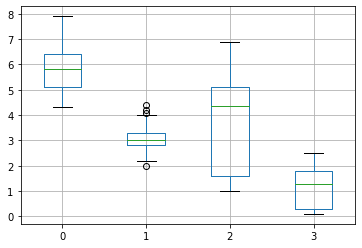
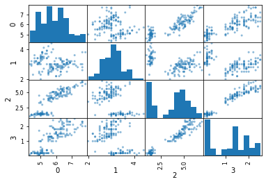
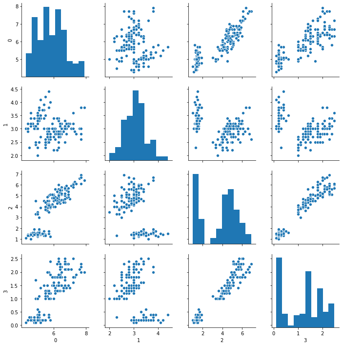
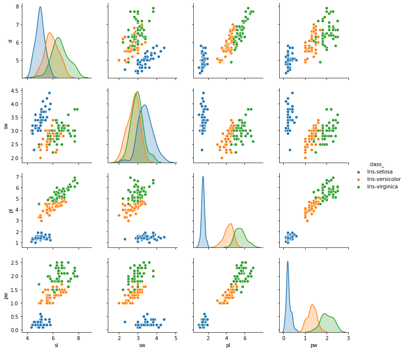
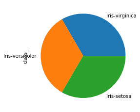

## 데이터의 종류
데이터의 종류는 다음과 같이 크게 세 가지로 분류할 수 있다.
- 정형(Structured) 데이터
- 반정형(Semi-Structured) 데이터
- 비정형(Unstructured) 데이터

### 정형 데이터
정형 데이터는 행(Column)과 열(Row)의 구조 즉, 말 그대로 구조화된 데이터를 의미한다. 이러한 데이터는 관계형 데이터베이스(RDB), 스프레드시트 및 CSV(엑셀) 등이 있다.

### 반정형 데이터
반정형 데이터는 형태가 존재하는데, 이를 스키마(Schema)와 메타 데이터(Meta data)라고 하며, 연산을 할 수 없는 데이터를 의미한다. 스키마와 메타 데이터로 이루어진, 즉 어떤 구조적 형태를 띄는 태그(tag)가 있는 XML 문서와 JSON 데이터가 대표적이다.

### 비정형 데이터
비정형 데이터는 말 그대로 형태가 존재하지 않는 데이터를 의미하며, 연산도 불가능하다. 흔히 SNS 등에서 볼 수 있는 텍스트 데이터, 스트리밍 데이터(이미지, 동영상) 등이 있다.

# 데이터 분석
이제 데이터를 분석해볼 차례다. 판다스를 임포트한다.


```python
import pandas as pd
```

데이터셋은 데이터 분석 연습용으로 많이 쓰이는 `Tidy-Data` 중에서, 전통적인 `붓꽃(irish)` 데이터로 진행하고자 한다.


```python
url = 'https://archive.ics.uci.edu/ml/machine-learning-databases/iris/iris.data'
```

우선, 여기서 불러올 데이터셋은 위의 링크를 통해 불러올 것이다.

## Tidy-Data
> "밑바닥 부터 시작할 필요 없는 데이터" (Tidy data there's no need to start from scratch.)

데이터 처리에 가장 많은 시간이 소요되는 전처리 과정을 줄이기 위해 처음부터 데이터를 표준화해서 만들어 놓은 데이터다.


```python
iris = pd.read_csv(url)
```

데이터를 한번 살펴보자. 분명 row 데이터인데, column으로 들어간 것을 확인할 수 있다.


```python
iris.head()
```


<div>
<style scoped>
    .dataframe tbody tr th:only-of-type {
        vertical-align: middle;
    }

    .dataframe tbody tr th {
        vertical-align: top;
    }

    .dataframe thead th {
        text-align: right;
    }
</style>
<table border="1" class="dataframe">
  <thead>
    <tr style="text-align: right;">
      <th></th>
      <th>5.1</th>
      <th>3.5</th>
      <th>1.4</th>
      <th>0.2</th>
      <th>Iris-setosa</th>
    </tr>
  </thead>
  <tbody>
    <tr>
      <th>0</th>
      <td>4.9</td>
      <td>3.0</td>
      <td>1.4</td>
      <td>0.2</td>
      <td>Iris-setosa</td>
    </tr>
    <tr>
      <th>1</th>
      <td>4.7</td>
      <td>3.2</td>
      <td>1.3</td>
      <td>0.2</td>
      <td>Iris-setosa</td>
    </tr>
    <tr>
      <th>2</th>
      <td>4.6</td>
      <td>3.1</td>
      <td>1.5</td>
      <td>0.2</td>
      <td>Iris-setosa</td>
    </tr>
    <tr>
      <th>3</th>
      <td>5.0</td>
      <td>3.6</td>
      <td>1.4</td>
      <td>0.2</td>
      <td>Iris-setosa</td>
    </tr>
    <tr>
      <th>4</th>
      <td>5.4</td>
      <td>3.9</td>
      <td>1.7</td>
      <td>0.4</td>
      <td>Iris-setosa</td>
    </tr>
  </tbody>
</table>
</div>


불러온 데이터에는 header가 정의되어 있지 않기 때문에 불러올 때 `헤더 없음`을 알려주어야 한다.


```python
iris = pd.read_csv(url, header=None)
```


```python
iris.head()
```


<div>
<style scoped>
    .dataframe tbody tr th:only-of-type {
        vertical-align: middle;
    }

    .dataframe tbody tr th {
        vertical-align: top;
    }

    .dataframe thead th {
        text-align: right;
    }
</style>
<table border="1" class="dataframe">
  <thead>
    <tr style="text-align: right;">
      <th></th>
      <th>0</th>
      <th>1</th>
      <th>2</th>
      <th>3</th>
      <th>4</th>
    </tr>
  </thead>
  <tbody>
    <tr>
      <th>0</th>
      <td>5.1</td>
      <td>3.5</td>
      <td>1.4</td>
      <td>0.2</td>
      <td>Iris-setosa</td>
    </tr>
    <tr>
      <th>1</th>
      <td>4.9</td>
      <td>3.0</td>
      <td>1.4</td>
      <td>0.2</td>
      <td>Iris-setosa</td>
    </tr>
    <tr>
      <th>2</th>
      <td>4.7</td>
      <td>3.2</td>
      <td>1.3</td>
      <td>0.2</td>
      <td>Iris-setosa</td>
    </tr>
    <tr>
      <th>3</th>
      <td>4.6</td>
      <td>3.1</td>
      <td>1.5</td>
      <td>0.2</td>
      <td>Iris-setosa</td>
    </tr>
    <tr>
      <th>4</th>
      <td>5.0</td>
      <td>3.6</td>
      <td>1.4</td>
      <td>0.2</td>
      <td>Iris-setosa</td>
    </tr>
  </tbody>
</table>
</div>


정상적으로 불러와진 것 같으니 `info`와 `describe` 메소드를 통해 데이터에 대한 정보를 확인해본다.


```python
iris.info()
```

    <class 'pandas.core.frame.DataFrame'>
    RangeIndex: 150 entries, 0 to 149
    Data columns (total 5 columns):
    0    150 non-null float64
    1    150 non-null float64
    2    150 non-null float64
    3    150 non-null float64
    4    150 non-null object
    dtypes: float64(4), object(1)
    memory usage: 5.9+ KB


```python
iris.describe()
```


<div>
<style scoped>
    .dataframe tbody tr th:only-of-type {
        vertical-align: middle;
    }

    .dataframe tbody tr th {
        vertical-align: top;
    }

    .dataframe thead th {
        text-align: right;
    }
</style>
<table border="1" class="dataframe">
  <thead>
    <tr style="text-align: right;">
      <th></th>
      <th>0</th>
      <th>1</th>
      <th>2</th>
      <th>3</th>
    </tr>
  </thead>
  <tbody>
    <tr>
      <th>count</th>
      <td>150.000000</td>
      <td>150.000000</td>
      <td>150.000000</td>
      <td>150.000000</td>
    </tr>
    <tr>
      <th>mean</th>
      <td>5.843333</td>
      <td>3.054000</td>
      <td>3.758667</td>
      <td>1.198667</td>
    </tr>
    <tr>
      <th>std</th>
      <td>0.828066</td>
      <td>0.433594</td>
      <td>1.764420</td>
      <td>0.763161</td>
    </tr>
    <tr>
      <th>min</th>
      <td>4.300000</td>
      <td>2.000000</td>
      <td>1.000000</td>
      <td>0.100000</td>
    </tr>
    <tr>
      <th>25%</th>
      <td>5.100000</td>
      <td>2.800000</td>
      <td>1.600000</td>
      <td>0.300000</td>
    </tr>
    <tr>
      <th>50%</th>
      <td>5.800000</td>
      <td>3.000000</td>
      <td>4.350000</td>
      <td>1.300000</td>
    </tr>
    <tr>
      <th>75%</th>
      <td>6.400000</td>
      <td>3.300000</td>
      <td>5.100000</td>
      <td>1.800000</td>
    </tr>
    <tr>
      <th>max</th>
      <td>7.900000</td>
      <td>4.400000</td>
      <td>6.900000</td>
      <td>2.500000</td>
    </tr>
  </tbody>
</table>
</div>


## Visualization
수치로 확인해보았으니 실제 그림을 그려서 눈에 잘 보이도록 Visualization을 해본다. 한번 `boxplot`을 그려본다.

jupyter에서 그래프가 잘 나오지 않을 경우, 다음과 같이 jupyter 매직 키워드를 입력해준다.


```python
%matplotlib inline
# %matplotlib notebook
```


```python
iris.boxplot()
```


    <matplotlib.axes._subplots.AxesSubplot at 0x7f67dd5b5d68>





`boxplot` 말고도 `Scatter`로도 그려본다.


```python
pd.plotting.scatter_matrix(iris)
```


    array([[<matplotlib.axes._subplots.AxesSubplot object at 0x7f67db236160>,
            <matplotlib.axes._subplots.AxesSubplot object at 0x7f67dab96748>,
            <matplotlib.axes._subplots.AxesSubplot object at 0x7f67dab47cf8>,
            <matplotlib.axes._subplots.AxesSubplot object at 0x7f67dab062e8>],
           [<matplotlib.axes._subplots.AxesSubplot object at 0x7f67daab5898>,
            <matplotlib.axes._subplots.AxesSubplot object at 0x7f67daa69e48>,
            <matplotlib.axes._subplots.AxesSubplot object at 0x7f67daa25438>,
            <matplotlib.axes._subplots.AxesSubplot object at 0x7f67daa58a20>],
           [<matplotlib.axes._subplots.AxesSubplot object at 0x7f67daa58a58>,
            <matplotlib.axes._subplots.AxesSubplot object at 0x7f67da9c6588>,
            <matplotlib.axes._subplots.AxesSubplot object at 0x7f67da977b38>,
            <matplotlib.axes._subplots.AxesSubplot object at 0x7f67da936080>],
           [<matplotlib.axes._subplots.AxesSubplot object at 0x7f67da8e3630>,
            <matplotlib.axes._subplots.AxesSubplot object at 0x7f67da916be0>,
            <matplotlib.axes._subplots.AxesSubplot object at 0x7f67da8d41d0>,
            <matplotlib.axes._subplots.AxesSubplot object at 0x7f67da885780>]],
          dtype=object)





`seaborn` 모듈에 `pairplot`을 통해 그래프를 한번에 출력할 수 있다.


```python
import seaborn as sns
```


```python
sns.pairplot(iris)
```


    <seaborn.axisgrid.PairGrid at 0x7f67c85e6a20>





불러온 데이터의 컬럼을 다시 한번 확인해보자.


```python
iris.columns
```


    Int64Index([0, 1, 2, 3, 4], dtype='int64')


단순히 0부터 4까지 컬럼명으로 되어있는데, 이를 더 보기 좋게 컬럼명을 바꾼다.


```python
iris.rename({0:'sl', 1:'sw', 2:'pl', 3:'pw', 4:'class_'}, axis=1, inplace=True)
```

이제 `class_` 데이터를 출력해본다.


```python
iris.head().class_
```


    0    Iris-setosa
    1    Iris-setosa
    2    Iris-setosa
    3    Iris-setosa
    4    Iris-setosa
    Name: class_, dtype: object


`class_`가 의미하는 것은 `iris`의 종류를 나타낸다.


```python
sns.pairplot(iris, hue='class_')
```


    <seaborn.axisgrid.PairGrid at 0x7f67c7a03eb8>





엑셀처럼 `pie` 그래프 역시 그릴 수 있다. 각 종류별 비율을 눈으로 확인해본다.


```python
iris['class_'].value_counts().plot.pie()
```


    <matplotlib.axes._subplots.AxesSubplot at 0x7f67c56a4ac8>





`corr` 메소드를 사용하면 `상관관계(correlation)` 분석도 가능하다.


```python
iris.corr()
```


<div>
<style scoped>
    .dataframe tbody tr th:only-of-type {
        vertical-align: middle;
    }

    .dataframe tbody tr th {
        vertical-align: top;
    }

    .dataframe thead th {
        text-align: right;
    }
</style>
<table border="1" class="dataframe">
  <thead>
    <tr style="text-align: right;">
      <th></th>
      <th>sl</th>
      <th>sw</th>
      <th>pl</th>
      <th>pw</th>
    </tr>
  </thead>
  <tbody>
    <tr>
      <th>sl</th>
      <td>1.000000</td>
      <td>-0.109369</td>
      <td>0.871754</td>
      <td>0.817954</td>
    </tr>
    <tr>
      <th>sw</th>
      <td>-0.109369</td>
      <td>1.000000</td>
      <td>-0.420516</td>
      <td>-0.356544</td>
    </tr>
    <tr>
      <th>pl</th>
      <td>0.871754</td>
      <td>-0.420516</td>
      <td>1.000000</td>
      <td>0.962757</td>
    </tr>
    <tr>
      <th>pw</th>
      <td>0.817954</td>
      <td>-0.356544</td>
      <td>0.962757</td>
      <td>1.000000</td>
    </tr>
  </tbody>
</table>
</div>


`skew` 메소드를 통해 `표본 비대칭도`를 확인한다.


```python
iris.skew()
```


    sl    0.314911
    sw    0.334053
    pl   -0.274464
    pw   -0.104997
    dtype: float64


마찬가지로, `kurt` 메소드로 `표본 첨도`를 확인한다.


```python
iris.kurt()
```


    sl   -0.552064
    sw    0.290781
    pl   -1.401921
    pw   -1.339754
    dtype: float64


기초 통계 분석 시 다음과 같은 두 개념을 알고가도록 하자.
- 큰 수의 법칙: 큰 모집단에서 무작위로 뽑은 표본의 평균이 전체 모집단의 평균과 가까울 가능성이 높다는 법칙. 예를들면, 서울시에서 100명을 대상으로 설문조사를 시행하여 그것을 토대로 분석하는 것이 그 예다. 
- 중심 극한 정리: 동일한 확률분포를 가진 독립 확률 변수 n개의 평균의 분포는 n이 적당히 크다면 정규분포에 가까워진다는 정리. 다시 풀어 얘기하면, 분산이 유한한 모집단에서 선택한 무작위 표본의 평균 분포는 모집단 분포의 모양에 관계없이 표본 크기가 커짐에 따라 정규 분포를 따르는 것을 의미한다.

Fancy Indexing으로 `class_`를 가져오면 그 타입은 `DataFrame`이다.


```python
type(iris[['class_']])
```


    pandas.core.frame.DataFrame


```python
iris[['class_']].info()
```

    <class 'pandas.core.frame.DataFrame'>
    RangeIndex: 150 entries, 0 to 149
    Data columns (total 1 columns):
    class_    150 non-null object
    dtypes: object(1)
    memory usage: 1.2+ KB


`groupby`로 데이터들을 그룹화시킬 수 있다. 그룹에 대한 평균값을 구해본다.


```python
iris.groupby('class_').mean()
```


<div>
<style scoped>
    .dataframe tbody tr th:only-of-type {
        vertical-align: middle;
    }

    .dataframe tbody tr th {
        vertical-align: top;
    }

    .dataframe thead th {
        text-align: right;
    }
</style>
<table border="1" class="dataframe">
  <thead>
    <tr style="text-align: right;">
      <th></th>
      <th>sl</th>
      <th>sw</th>
      <th>pl</th>
      <th>pw</th>
    </tr>
    <tr>
      <th>class_</th>
      <th></th>
      <th></th>
      <th></th>
      <th></th>
    </tr>
  </thead>
  <tbody>
    <tr>
      <th>Iris-setosa</th>
      <td>5.006</td>
      <td>3.418</td>
      <td>1.464</td>
      <td>0.244</td>
    </tr>
    <tr>
      <th>Iris-versicolor</th>
      <td>5.936</td>
      <td>2.770</td>
      <td>4.260</td>
      <td>1.326</td>
    </tr>
    <tr>
      <th>Iris-virginica</th>
      <td>6.588</td>
      <td>2.974</td>
      <td>5.552</td>
      <td>2.026</td>
    </tr>
  </tbody>
</table>
</div>


`unique` 메소드로 중복되는 값들을 제외하고 가져온다.


```python
iris['class_'].unique()
```


    array(['Iris-setosa', 'Iris-versicolor', 'Iris-virginica'], dtype=object)


## 또다른 데이터 분석
이제 실질적인(이 또한 연습용 Tidy-data에 가깝지만...) 데이터를 가지고 사용한다.

자료는 <a href='https://github.com/chendaniely/pandas_for_everyone'>여기</a> 혹은 <a href='http://stat405.had.co.nz/'>여기</a>를 통해 받을 수 있다.

먼저, 날씨 데이터를 가져온다.


```python
weather = pd.read_csv('weather.txt', sep='\t')
```

간단히 `info`와 `head`를 통해 살펴보도록 하자.


```python
weather.info()
```

    <class 'pandas.core.frame.DataFrame'>
    RangeIndex: 22 entries, 0 to 21
    Data columns (total 35 columns):
    id         22 non-null object
    year       22 non-null int64
    month      22 non-null int64
    element    22 non-null object
    d1         2 non-null float64
    d2         4 non-null float64
    d3         4 non-null float64
    d4         2 non-null float64
    d5         8 non-null float64
    d6         2 non-null float64
    d7         2 non-null float64
    d8         2 non-null float64
    d9         0 non-null float64
    d10        2 non-null float64
    d11        2 non-null float64
    d12        0 non-null float64
    d13        2 non-null float64
    d14        4 non-null float64
    d15        2 non-null float64
    d16        2 non-null float64
    d17        2 non-null float64
    d18        0 non-null float64
    d19        0 non-null float64
    d20        0 non-null float64
    d21        0 non-null float64
    d22        0 non-null float64
    d23        4 non-null float64
    d24        0 non-null float64
    d25        2 non-null float64
    d26        2 non-null float64
    d27        6 non-null float64
    d28        2 non-null float64
    d29        4 non-null float64
    d30        2 non-null float64
    d31        2 non-null float64
    dtypes: float64(31), int64(2), object(2)
    memory usage: 6.1+ KB


```python
weather.head()
```


<div>
<style scoped>
    .dataframe tbody tr th:only-of-type {
        vertical-align: middle;
    }

    .dataframe tbody tr th {
        vertical-align: top;
    }

    .dataframe thead th {
        text-align: right;
    }
</style>
<table border="1" class="dataframe">
  <thead>
    <tr style="text-align: right;">
      <th></th>
      <th>id</th>
      <th>year</th>
      <th>month</th>
      <th>element</th>
      <th>d1</th>
      <th>d2</th>
      <th>d3</th>
      <th>d4</th>
      <th>d5</th>
      <th>d6</th>
      <th>...</th>
      <th>d22</th>
      <th>d23</th>
      <th>d24</th>
      <th>d25</th>
      <th>d26</th>
      <th>d27</th>
      <th>d28</th>
      <th>d29</th>
      <th>d30</th>
      <th>d31</th>
    </tr>
  </thead>
  <tbody>
    <tr>
      <th>0</th>
      <td>MX000017004</td>
      <td>2010</td>
      <td>1</td>
      <td>TMAX</td>
      <td>NaN</td>
      <td>NaN</td>
      <td>NaN</td>
      <td>NaN</td>
      <td>NaN</td>
      <td>NaN</td>
      <td>...</td>
      <td>NaN</td>
      <td>NaN</td>
      <td>NaN</td>
      <td>NaN</td>
      <td>NaN</td>
      <td>NaN</td>
      <td>NaN</td>
      <td>NaN</td>
      <td>278.0</td>
      <td>NaN</td>
    </tr>
    <tr>
      <th>1</th>
      <td>MX000017004</td>
      <td>2010</td>
      <td>1</td>
      <td>TMIN</td>
      <td>NaN</td>
      <td>NaN</td>
      <td>NaN</td>
      <td>NaN</td>
      <td>NaN</td>
      <td>NaN</td>
      <td>...</td>
      <td>NaN</td>
      <td>NaN</td>
      <td>NaN</td>
      <td>NaN</td>
      <td>NaN</td>
      <td>NaN</td>
      <td>NaN</td>
      <td>NaN</td>
      <td>145.0</td>
      <td>NaN</td>
    </tr>
    <tr>
      <th>2</th>
      <td>MX000017004</td>
      <td>2010</td>
      <td>2</td>
      <td>TMAX</td>
      <td>NaN</td>
      <td>273.0</td>
      <td>241.0</td>
      <td>NaN</td>
      <td>NaN</td>
      <td>NaN</td>
      <td>...</td>
      <td>NaN</td>
      <td>299.0</td>
      <td>NaN</td>
      <td>NaN</td>
      <td>NaN</td>
      <td>NaN</td>
      <td>NaN</td>
      <td>NaN</td>
      <td>NaN</td>
      <td>NaN</td>
    </tr>
    <tr>
      <th>3</th>
      <td>MX000017004</td>
      <td>2010</td>
      <td>2</td>
      <td>TMIN</td>
      <td>NaN</td>
      <td>144.0</td>
      <td>144.0</td>
      <td>NaN</td>
      <td>NaN</td>
      <td>NaN</td>
      <td>...</td>
      <td>NaN</td>
      <td>107.0</td>
      <td>NaN</td>
      <td>NaN</td>
      <td>NaN</td>
      <td>NaN</td>
      <td>NaN</td>
      <td>NaN</td>
      <td>NaN</td>
      <td>NaN</td>
    </tr>
    <tr>
      <th>4</th>
      <td>MX000017004</td>
      <td>2010</td>
      <td>3</td>
      <td>TMAX</td>
      <td>NaN</td>
      <td>NaN</td>
      <td>NaN</td>
      <td>NaN</td>
      <td>321.0</td>
      <td>NaN</td>
      <td>...</td>
      <td>NaN</td>
      <td>NaN</td>
      <td>NaN</td>
      <td>NaN</td>
      <td>NaN</td>
      <td>NaN</td>
      <td>NaN</td>
      <td>NaN</td>
      <td>NaN</td>
      <td>NaN</td>
    </tr>
  </tbody>
</table>
<p>5 rows × 35 columns</p>
</div>


### melt
`melt` 메소드는 `id`를 기준으로 원래 데이터셋에 있던 여러 개의 컬럼 이름을 `variable` 컬럼에 위에서 아래로 길게 쌓고, `value` 컬럼에 `id`와 `variable`에 해당하는 값을 넣어주는 식으로 데이터를 재구조화 시킨다.

위의 결과를 살펴보면 `NaN`값이 굉장히 많다는 것을 확인할 수 있다. 우선 연습삼아 `dropna`를 통해 이를 제거해본다.


```python
data = weather.melt(['id', 'year', 'month', 'element'], var_name='date').dropna()
```


```python
data.sample(5)
```


<div>
<style scoped>
    .dataframe tbody tr th:only-of-type {
        vertical-align: middle;
    }

    .dataframe tbody tr th {
        vertical-align: top;
    }

    .dataframe thead th {
        text-align: right;
    }
</style>
<table border="1" class="dataframe">
  <thead>
    <tr style="text-align: right;">
      <th></th>
      <th>id</th>
      <th>year</th>
      <th>month</th>
      <th>element</th>
      <th>date</th>
      <th>value</th>
    </tr>
  </thead>
  <tbody>
    <tr>
      <th>169</th>
      <td>MX000017004</td>
      <td>2010</td>
      <td>8</td>
      <td>TMIN</td>
      <td>d8</td>
      <td>173.0</td>
    </tr>
    <tr>
      <th>630</th>
      <td>MX000017004</td>
      <td>2010</td>
      <td>8</td>
      <td>TMAX</td>
      <td>d29</td>
      <td>280.0</td>
    </tr>
    <tr>
      <th>102</th>
      <td>MX000017004</td>
      <td>2010</td>
      <td>8</td>
      <td>TMAX</td>
      <td>d5</td>
      <td>296.0</td>
    </tr>
    <tr>
      <th>85</th>
      <td>MX000017004</td>
      <td>2010</td>
      <td>11</td>
      <td>TMIN</td>
      <td>d4</td>
      <td>120.0</td>
    </tr>
    <tr>
      <th>363</th>
      <td>MX000017004</td>
      <td>2010</td>
      <td>6</td>
      <td>TMIN</td>
      <td>d17</td>
      <td>175.0</td>
    </tr>
  </tbody>
</table>
</div>


## IPA 주관 인공지능센터 기본(fundamental) 과정
- GitHub link: <a href='https://github.com/Wind-Kyle/python-fundamentals'>here</a>
- E-Mail: windkyle7@gmail.com
