`pandas`의 자료형에는 `숫자(int, float)`, `문자(object, category)`, `날짜(date)`가 있다. 


```python
import pandas as pd
import numpy as np
import seaborn as sns
```

실습을 위해서 만만한 `tips` 데이터를 불러온다.


```python
tips = sns.load_dataset('tips')
```

`info`를 통해 살펴보면 `memory usage`라는 것이 있다. `memory useage`란, 메모리 상에 데이터를 올리고 큰 데이터의 경우 분산처리를 하여 올린다.


```python
tips.info()
```

    <class 'pandas.core.frame.DataFrame'>
    RangeIndex: 244 entries, 0 to 243
    Data columns (total 7 columns):
    total_bill    244 non-null float64
    tip           244 non-null float64
    sex           244 non-null category
    smoker        244 non-null category
    day           244 non-null category
    time          244 non-null category
    size          244 non-null int64
    dtypes: category(4), float64(2), int64(1)
    memory usage: 7.2 KB


`corr` 메소드는 상관분석(correlation)을 의미한다.


```python
tips.corr()
```


<div>
<style scoped>
    .dataframe tbody tr th:only-of-type {
        vertical-align: middle;
    }

    .dataframe tbody tr th {
        vertical-align: top;
    }

    .dataframe thead th {
        text-align: right;
    }
</style>
<table border="1" class="dataframe">
  <thead>
    <tr style="text-align: right;">
      <th></th>
      <th>total_bill</th>
      <th>tip</th>
      <th>size</th>
    </tr>
  </thead>
  <tbody>
    <tr>
      <th>total_bill</th>
      <td>1.000000</td>
      <td>0.675734</td>
      <td>0.598315</td>
    </tr>
    <tr>
      <th>tip</th>
      <td>0.675734</td>
      <td>1.000000</td>
      <td>0.489299</td>
    </tr>
    <tr>
      <th>size</th>
      <td>0.598315</td>
      <td>0.489299</td>
      <td>1.000000</td>
    </tr>
  </tbody>
</table>
</div>


이에 대한 `heatmap`을 그려본다.


```python
sns.heatmap(tips.corr(), cbar=False, annot=True)
```


    <matplotlib.axes._subplots.AxesSubplot at 0x7f71ccaf72b0>


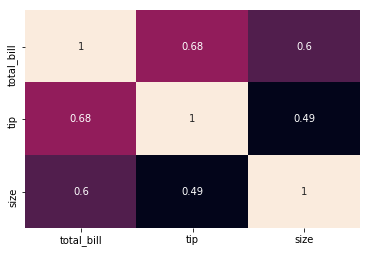


흡연자 중에서 남자와 여자의 수를 알고 싶을 때, 다음과 같이 `value_counts`를 사용한다.


```python
tips[tips.smoker=='Yes'].sex.value_counts()
```


    Male      60
    Female    33
    Name: sex, dtype: int64


이에 대한 그래프를 그려보면 다음과 같다.


```python
tips[tips.smoker=='Yes'].sex.value_counts().plot.bar()
```


    <matplotlib.axes._subplots.AxesSubplot at 0x7f71c46b42b0>


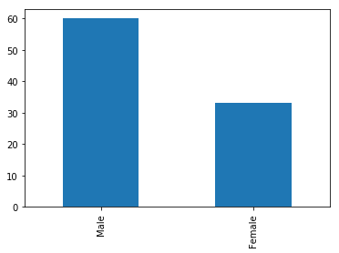


`팬시 인덱싱`으로 다음과 같이 뽑아올 수도 있다.


```python
tips[tips.smoker=='Yes'][['sex','smoker']].sample(5)
```


<div>
<style scoped>
    .dataframe tbody tr th:only-of-type {
        vertical-align: middle;
    }

    .dataframe tbody tr th {
        vertical-align: top;
    }

    .dataframe thead th {
        text-align: right;
    }
</style>
<table border="1" class="dataframe">
  <thead>
    <tr style="text-align: right;">
      <th></th>
      <th>sex</th>
      <th>smoker</th>
    </tr>
  </thead>
  <tbody>
    <tr>
      <th>202</th>
      <td>Female</td>
      <td>Yes</td>
    </tr>
    <tr>
      <th>189</th>
      <td>Male</td>
      <td>Yes</td>
    </tr>
    <tr>
      <th>199</th>
      <td>Male</td>
      <td>Yes</td>
    </tr>
    <tr>
      <th>191</th>
      <td>Female</td>
      <td>Yes</td>
    </tr>
    <tr>
      <th>213</th>
      <td>Female</td>
      <td>Yes</td>
    </tr>
  </tbody>
</table>
</div>


`iteritems`를 통해 제너레이터를 생성하여 `next` 함수로 순회할 수 있다. `DataFrame` 객체의 `iteritems`를 불러오면 각 컬럼에 대한 열(row)을 가져온다.


```python
iter_ = tips.iteritems()
```


```python
next_ = next(iter_)
```


```python
next_[0]
```


    'total_bill'


```python
next_[1][:10]
```


    0    16.99
    1    10.34
    2    21.01
    3    23.68
    4    24.59
    5    25.29
    6     8.77
    7    26.88
    8    15.04
    9    14.78
    Name: total_bill, dtype: float64


행으로 가져오고 싶을 때는 `iterrows`로 가져올 수 있다.


```python
next(tips.iterrows())
```


    (0, total_bill     16.99
     tip             1.01
     sex           Female
     smoker            No
     day              Sun
     time          Dinner
     size               2
     Name: 0, dtype: object)


## vincent


```python
# !pip install vincent
```


```python
# !pip install -q pdvega
```


```python
tips[['total_bill','smoker']].set_index('smoker')
```


<div>
<style scoped>
    .dataframe tbody tr th:only-of-type {
        vertical-align: middle;
    }

    .dataframe tbody tr th {
        vertical-align: top;
    }

    .dataframe thead th {
        text-align: right;
    }
</style>
<table border="1" class="dataframe">
  <thead>
    <tr style="text-align: right;">
      <th></th>
      <th>total_bill</th>
    </tr>
    <tr>
      <th>smoker</th>
      <th></th>
    </tr>
  </thead>
  <tbody>
    <tr>
      <th>No</th>
      <td>16.99</td>
    </tr>
    <tr>
      <th>No</th>
      <td>10.34</td>
    </tr>
    <tr>
      <th>No</th>
      <td>21.01</td>
    </tr>
    <tr>
      <th>No</th>
      <td>23.68</td>
    </tr>
    <tr>
      <th>No</th>
      <td>24.59</td>
    </tr>
    <tr>
      <th>No</th>
      <td>25.29</td>
    </tr>
    <tr>
      <th>No</th>
      <td>8.77</td>
    </tr>
    <tr>
      <th>No</th>
      <td>26.88</td>
    </tr>
    <tr>
      <th>No</th>
      <td>15.04</td>
    </tr>
    <tr>
      <th>No</th>
      <td>14.78</td>
    </tr>
    <tr>
      <th>No</th>
      <td>10.27</td>
    </tr>
    <tr>
      <th>No</th>
      <td>35.26</td>
    </tr>
    <tr>
      <th>No</th>
      <td>15.42</td>
    </tr>
    <tr>
      <th>No</th>
      <td>18.43</td>
    </tr>
    <tr>
      <th>No</th>
      <td>14.83</td>
    </tr>
    <tr>
      <th>No</th>
      <td>21.58</td>
    </tr>
    <tr>
      <th>No</th>
      <td>10.33</td>
    </tr>
    <tr>
      <th>No</th>
      <td>16.29</td>
    </tr>
    <tr>
      <th>No</th>
      <td>16.97</td>
    </tr>
    <tr>
      <th>No</th>
      <td>20.65</td>
    </tr>
    <tr>
      <th>No</th>
      <td>17.92</td>
    </tr>
    <tr>
      <th>No</th>
      <td>20.29</td>
    </tr>
    <tr>
      <th>No</th>
      <td>15.77</td>
    </tr>
    <tr>
      <th>No</th>
      <td>39.42</td>
    </tr>
    <tr>
      <th>No</th>
      <td>19.82</td>
    </tr>
    <tr>
      <th>No</th>
      <td>17.81</td>
    </tr>
    <tr>
      <th>No</th>
      <td>13.37</td>
    </tr>
    <tr>
      <th>No</th>
      <td>12.69</td>
    </tr>
    <tr>
      <th>No</th>
      <td>21.70</td>
    </tr>
    <tr>
      <th>No</th>
      <td>19.65</td>
    </tr>
    <tr>
      <th>...</th>
      <td>...</td>
    </tr>
    <tr>
      <th>Yes</th>
      <td>28.17</td>
    </tr>
    <tr>
      <th>Yes</th>
      <td>12.90</td>
    </tr>
    <tr>
      <th>Yes</th>
      <td>28.15</td>
    </tr>
    <tr>
      <th>Yes</th>
      <td>11.59</td>
    </tr>
    <tr>
      <th>Yes</th>
      <td>7.74</td>
    </tr>
    <tr>
      <th>Yes</th>
      <td>30.14</td>
    </tr>
    <tr>
      <th>Yes</th>
      <td>12.16</td>
    </tr>
    <tr>
      <th>Yes</th>
      <td>13.42</td>
    </tr>
    <tr>
      <th>Yes</th>
      <td>8.58</td>
    </tr>
    <tr>
      <th>No</th>
      <td>15.98</td>
    </tr>
    <tr>
      <th>Yes</th>
      <td>13.42</td>
    </tr>
    <tr>
      <th>Yes</th>
      <td>16.27</td>
    </tr>
    <tr>
      <th>Yes</th>
      <td>10.09</td>
    </tr>
    <tr>
      <th>No</th>
      <td>20.45</td>
    </tr>
    <tr>
      <th>No</th>
      <td>13.28</td>
    </tr>
    <tr>
      <th>Yes</th>
      <td>22.12</td>
    </tr>
    <tr>
      <th>Yes</th>
      <td>24.01</td>
    </tr>
    <tr>
      <th>Yes</th>
      <td>15.69</td>
    </tr>
    <tr>
      <th>No</th>
      <td>11.61</td>
    </tr>
    <tr>
      <th>No</th>
      <td>10.77</td>
    </tr>
    <tr>
      <th>Yes</th>
      <td>15.53</td>
    </tr>
    <tr>
      <th>No</th>
      <td>10.07</td>
    </tr>
    <tr>
      <th>Yes</th>
      <td>12.60</td>
    </tr>
    <tr>
      <th>Yes</th>
      <td>32.83</td>
    </tr>
    <tr>
      <th>No</th>
      <td>35.83</td>
    </tr>
    <tr>
      <th>No</th>
      <td>29.03</td>
    </tr>
    <tr>
      <th>Yes</th>
      <td>27.18</td>
    </tr>
    <tr>
      <th>Yes</th>
      <td>22.67</td>
    </tr>
    <tr>
      <th>No</th>
      <td>17.82</td>
    </tr>
    <tr>
      <th>No</th>
      <td>18.78</td>
    </tr>
  </tbody>
</table>
<p>244 rows × 1 columns</p>
</div>


```python
x = tips[['total_bill','smoker']].groupby('smoker')
x.mean()
```


<div>
<style scoped>
    .dataframe tbody tr th:only-of-type {
        vertical-align: middle;
    }

    .dataframe tbody tr th {
        vertical-align: top;
    }

    .dataframe thead th {
        text-align: right;
    }
</style>
<table border="1" class="dataframe">
  <thead>
    <tr style="text-align: right;">
      <th></th>
      <th>total_bill</th>
    </tr>
    <tr>
      <th>smoker</th>
      <th></th>
    </tr>
  </thead>
  <tbody>
    <tr>
      <th>Yes</th>
      <td>20.756344</td>
    </tr>
    <tr>
      <th>No</th>
      <td>19.188278</td>
    </tr>
  </tbody>
</table>
</div>


```python
s = tips.groupby('smoker').mean().total_bill
```

## pdvega


```python
# !pip install --upgrade pdvega
```


```python
import pdvega
```

아래는 에러 메시지가 거슬려서 넣어주었다.


```python
import warnings
warnings.filterwarnings('ignore')
```


```python
s.vgplot.bar()
```


<div class="vega-embed" id="a0ddc6a5-a881-4bb6-9861-2f9496940647"></div>

<style>
.vega-embed .vega-actions > a {
    transition: opacity 200ms ease-in;
    opacity: 0.3;
    margin-right: 0.6em;
    color: #444;
    text-decoration: none;
}

.vega-embed .vega-actions > a:hover {
    color: #000;
    text-decoration: underline;
}

.vega-embed:hover .vega-actions > a {
    opacity: 1;
    transition: 0s;
}

.vega-embed .error p {
    color: firebrick;
    font-size: 1.2em;
}
</style>


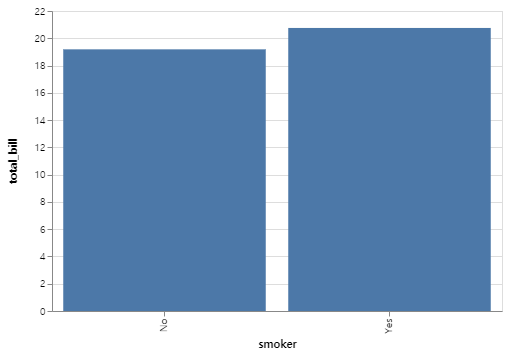


```python
tips.pivot_table(index='smoker',columns='sex', aggfunc=np.sum, margins=True)
```


<div>
<style scoped>
    .dataframe tbody tr th:only-of-type {
        vertical-align: middle;
    }

    .dataframe tbody tr th {
        vertical-align: top;
    }

    .dataframe thead tr th {
        text-align: left;
    }

    .dataframe thead tr:last-of-type th {
        text-align: right;
    }
</style>
<table border="1" class="dataframe">
  <thead>
    <tr>
      <th></th>
      <th colspan="3" halign="left">size</th>
      <th colspan="3" halign="left">tip</th>
      <th colspan="3" halign="left">total_bill</th>
    </tr>
    <tr>
      <th>sex</th>
      <th>Male</th>
      <th>Female</th>
      <th>All</th>
      <th>Male</th>
      <th>Female</th>
      <th>All</th>
      <th>Male</th>
      <th>Female</th>
      <th>All</th>
    </tr>
    <tr>
      <th>smoker</th>
      <th></th>
      <th></th>
      <th></th>
      <th></th>
      <th></th>
      <th></th>
      <th></th>
      <th></th>
      <th></th>
    </tr>
  </thead>
  <tbody>
    <tr>
      <th>Yes</th>
      <td>150</td>
      <td>74</td>
      <td>224</td>
      <td>183.07</td>
      <td>96.74</td>
      <td>279.81</td>
      <td>1337.07</td>
      <td>593.27</td>
      <td>1930.34</td>
    </tr>
    <tr>
      <th>No</th>
      <td>263</td>
      <td>140</td>
      <td>403</td>
      <td>302.00</td>
      <td>149.77</td>
      <td>451.77</td>
      <td>1919.75</td>
      <td>977.68</td>
      <td>2897.43</td>
    </tr>
    <tr>
      <th>All</th>
      <td>413</td>
      <td>214</td>
      <td>627</td>
      <td>485.07</td>
      <td>246.51</td>
      <td>731.58</td>
      <td>3256.82</td>
      <td>1570.95</td>
      <td>4827.77</td>
    </tr>
  </tbody>
</table>
</div>


```python
pd.crosstab([tips.smoker, tips.sex], tips.time, values=tips.tip, aggfunc=np.mean)
```


<div>
<style scoped>
    .dataframe tbody tr th:only-of-type {
        vertical-align: middle;
    }

    .dataframe tbody tr th {
        vertical-align: top;
    }

    .dataframe thead th {
        text-align: right;
    }
</style>
<table border="1" class="dataframe">
  <thead>
    <tr style="text-align: right;">
      <th></th>
      <th>time</th>
      <th>Lunch</th>
      <th>Dinner</th>
    </tr>
    <tr>
      <th>smoker</th>
      <th>sex</th>
      <th></th>
      <th></th>
    </tr>
  </thead>
  <tbody>
    <tr>
      <th rowspan="2" valign="top">Yes</th>
      <th>Male</th>
      <td>2.790769</td>
      <td>3.123191</td>
    </tr>
    <tr>
      <th>Female</th>
      <td>2.891000</td>
      <td>2.949130</td>
    </tr>
    <tr>
      <th rowspan="2" valign="top">No</th>
      <th>Male</th>
      <td>2.941500</td>
      <td>3.158052</td>
    </tr>
    <tr>
      <th>Female</th>
      <td>2.459600</td>
      <td>3.044138</td>
    </tr>
  </tbody>
</table>
</div>


```python
pd.crosstab([tips.smoker, tips.sex], tips.time, values=tips.tip, aggfunc=np.mean).index
```


    MultiIndex(levels=[['Yes', 'No'], ['Male', 'Female']],
               codes=[[0, 0, 1, 1], [0, 1, 0, 1]],
               names=['smoker', 'sex'])


## reset index


```python
x = tips[tips.sex=='Male'].loc[:15]
```


```python
x.reset_index(drop=True)
```


<div>
<style scoped>
    .dataframe tbody tr th:only-of-type {
        vertical-align: middle;
    }

    .dataframe tbody tr th {
        vertical-align: top;
    }

    .dataframe thead th {
        text-align: right;
    }
</style>
<table border="1" class="dataframe">
  <thead>
    <tr style="text-align: right;">
      <th></th>
      <th>total_bill</th>
      <th>tip</th>
      <th>sex</th>
      <th>smoker</th>
      <th>day</th>
      <th>time</th>
      <th>size</th>
    </tr>
  </thead>
  <tbody>
    <tr>
      <th>0</th>
      <td>10.34</td>
      <td>1.66</td>
      <td>Male</td>
      <td>No</td>
      <td>Sun</td>
      <td>Dinner</td>
      <td>3</td>
    </tr>
    <tr>
      <th>1</th>
      <td>21.01</td>
      <td>3.50</td>
      <td>Male</td>
      <td>No</td>
      <td>Sun</td>
      <td>Dinner</td>
      <td>3</td>
    </tr>
    <tr>
      <th>2</th>
      <td>23.68</td>
      <td>3.31</td>
      <td>Male</td>
      <td>No</td>
      <td>Sun</td>
      <td>Dinner</td>
      <td>2</td>
    </tr>
    <tr>
      <th>3</th>
      <td>25.29</td>
      <td>4.71</td>
      <td>Male</td>
      <td>No</td>
      <td>Sun</td>
      <td>Dinner</td>
      <td>4</td>
    </tr>
    <tr>
      <th>4</th>
      <td>8.77</td>
      <td>2.00</td>
      <td>Male</td>
      <td>No</td>
      <td>Sun</td>
      <td>Dinner</td>
      <td>2</td>
    </tr>
    <tr>
      <th>5</th>
      <td>26.88</td>
      <td>3.12</td>
      <td>Male</td>
      <td>No</td>
      <td>Sun</td>
      <td>Dinner</td>
      <td>4</td>
    </tr>
    <tr>
      <th>6</th>
      <td>15.04</td>
      <td>1.96</td>
      <td>Male</td>
      <td>No</td>
      <td>Sun</td>
      <td>Dinner</td>
      <td>2</td>
    </tr>
    <tr>
      <th>7</th>
      <td>14.78</td>
      <td>3.23</td>
      <td>Male</td>
      <td>No</td>
      <td>Sun</td>
      <td>Dinner</td>
      <td>2</td>
    </tr>
    <tr>
      <th>8</th>
      <td>10.27</td>
      <td>1.71</td>
      <td>Male</td>
      <td>No</td>
      <td>Sun</td>
      <td>Dinner</td>
      <td>2</td>
    </tr>
    <tr>
      <th>9</th>
      <td>15.42</td>
      <td>1.57</td>
      <td>Male</td>
      <td>No</td>
      <td>Sun</td>
      <td>Dinner</td>
      <td>2</td>
    </tr>
    <tr>
      <th>10</th>
      <td>18.43</td>
      <td>3.00</td>
      <td>Male</td>
      <td>No</td>
      <td>Sun</td>
      <td>Dinner</td>
      <td>4</td>
    </tr>
    <tr>
      <th>11</th>
      <td>21.58</td>
      <td>3.92</td>
      <td>Male</td>
      <td>No</td>
      <td>Sun</td>
      <td>Dinner</td>
      <td>2</td>
    </tr>
  </tbody>
</table>
</div>


```python
tips.groupby(['sex','smoker']).mean()[['tip']]
```


<div>
<style scoped>
    .dataframe tbody tr th:only-of-type {
        vertical-align: middle;
    }

    .dataframe tbody tr th {
        vertical-align: top;
    }

    .dataframe thead th {
        text-align: right;
    }
</style>
<table border="1" class="dataframe">
  <thead>
    <tr style="text-align: right;">
      <th></th>
      <th></th>
      <th>tip</th>
    </tr>
    <tr>
      <th>sex</th>
      <th>smoker</th>
      <th></th>
    </tr>
  </thead>
  <tbody>
    <tr>
      <th rowspan="2" valign="top">Male</th>
      <th>Yes</th>
      <td>3.051167</td>
    </tr>
    <tr>
      <th>No</th>
      <td>3.113402</td>
    </tr>
    <tr>
      <th rowspan="2" valign="top">Female</th>
      <th>Yes</th>
      <td>2.931515</td>
    </tr>
    <tr>
      <th>No</th>
      <td>2.773519</td>
    </tr>
  </tbody>
</table>
</div>


## stack and unstack


```python
group = tips.groupby(['sex','smoker']).mean()
```


```python
group[['tip']].unstack()
```


<div>
<style scoped>
    .dataframe tbody tr th:only-of-type {
        vertical-align: middle;
    }

    .dataframe tbody tr th {
        vertical-align: top;
    }

    .dataframe thead tr th {
        text-align: left;
    }

    .dataframe thead tr:last-of-type th {
        text-align: right;
    }
</style>
<table border="1" class="dataframe">
  <thead>
    <tr>
      <th></th>
      <th colspan="2" halign="left">tip</th>
    </tr>
    <tr>
      <th>smoker</th>
      <th>Yes</th>
      <th>No</th>
    </tr>
    <tr>
      <th>sex</th>
      <th></th>
      <th></th>
    </tr>
  </thead>
  <tbody>
    <tr>
      <th>Male</th>
      <td>3.051167</td>
      <td>3.113402</td>
    </tr>
    <tr>
      <th>Female</th>
      <td>2.931515</td>
      <td>2.773519</td>
    </tr>
  </tbody>
</table>
</div>


```python
group[['tip']].stack()
```


    sex     smoker     
    Male    Yes     tip    3.051167
            No      tip    3.113402
    Female  Yes     tip    2.931515
            No      tip    2.773519
    dtype: float64


```python
tips.groupby('sex').mean()[['tip']].unstack()
```


         sex   
    tip  Male      3.089618
         Female    2.833448
    dtype: float64


```python
tips.groupby('sex').mean()[['tip']].unstack().plot.bar()
```


    <matplotlib.axes._subplots.AxesSubplot at 0x7f71c462a320>


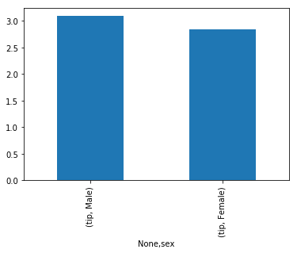


```python
tips.groupby('day').mean()[['tip']].unstack().plot.bar(stacked=False)
```


    <matplotlib.axes._subplots.AxesSubplot at 0x7f71c457acf8>


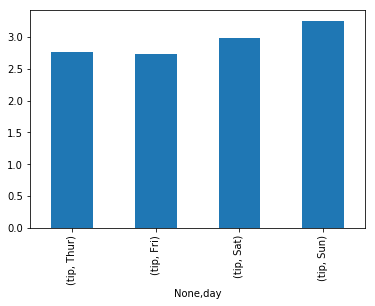


```python
group = tips.groupby(['day','sex']).mean()
```


```python
group[['tip']].plot.bar()
```


    <matplotlib.axes._subplots.AxesSubplot at 0x7f71c4562438>


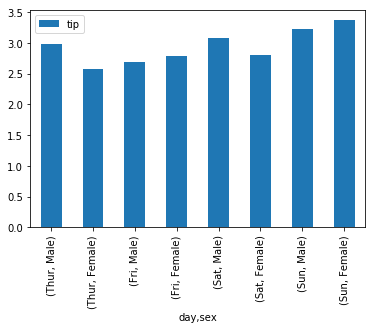


```python
group[['tip']].unstack()
```


<div>
<style scoped>
    .dataframe tbody tr th:only-of-type {
        vertical-align: middle;
    }

    .dataframe tbody tr th {
        vertical-align: top;
    }

    .dataframe thead tr th {
        text-align: left;
    }

    .dataframe thead tr:last-of-type th {
        text-align: right;
    }
</style>
<table border="1" class="dataframe">
  <thead>
    <tr>
      <th></th>
      <th colspan="2" halign="left">tip</th>
    </tr>
    <tr>
      <th>sex</th>
      <th>Male</th>
      <th>Female</th>
    </tr>
    <tr>
      <th>day</th>
      <th></th>
      <th></th>
    </tr>
  </thead>
  <tbody>
    <tr>
      <th>Thur</th>
      <td>2.980333</td>
      <td>2.575625</td>
    </tr>
    <tr>
      <th>Fri</th>
      <td>2.693000</td>
      <td>2.781111</td>
    </tr>
    <tr>
      <th>Sat</th>
      <td>3.083898</td>
      <td>2.801786</td>
    </tr>
    <tr>
      <th>Sun</th>
      <td>3.220345</td>
      <td>3.367222</td>
    </tr>
  </tbody>
</table>
</div>


```python
group[['tip']].unstack().plot.bar()
```


    <matplotlib.axes._subplots.AxesSubplot at 0x7f71c46a2dd8>


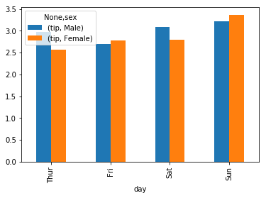


```python
group[['tip']].unstack().plot.bar(stacked=True)
```


    <matplotlib.axes._subplots.AxesSubplot at 0x7f71c4460198>


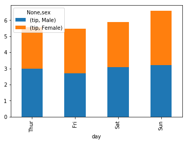


```python
group[['tip','total_bill']].plot.bar()
```


    <matplotlib.axes._subplots.AxesSubplot at 0x7f71c43e3c88>


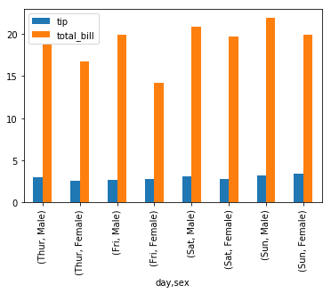


```python
group[['tip','total_bill']].unstack().plot.bar()
```


    <matplotlib.axes._subplots.AxesSubplot at 0x7f71c43660f0>


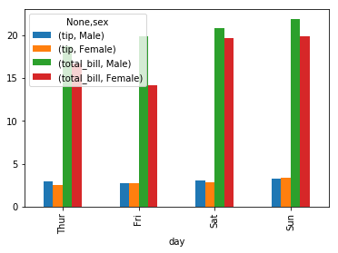


```python
group[['tip','total_bill']].unstack().plot.bar(stacked=True)
```


    <matplotlib.axes._subplots.AxesSubplot at 0x7f71c42e64e0>


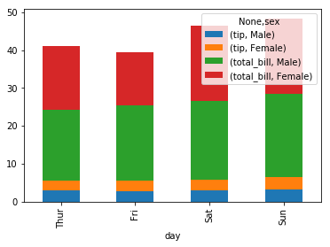


```python
group[['tip','total_bill']].unstack(0).plot.bar(stacked=True)
```


    <matplotlib.axes._subplots.AxesSubplot at 0x7f71c41ffd30>


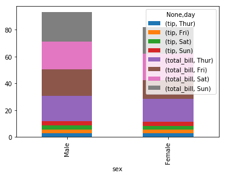


---

## IPA 주관 인공지능센터 기본(fundamental) 과정
- GitHub link: here
- E-Mail: windkyle7@gmail.com
